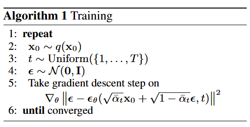
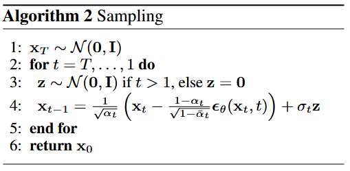

## Diffusion Model

扩散模型是一种生成模型，通过对数据的噪声逐步增加（向前扩散）和逐步减少（反向扩散）的过程，实现从随机噪声中生成样本。以下是这两个过程的简要说明：

------

### **1. 向前扩散（Forward Diffusion）**

**目标：** 通过逐步添加噪声，将数据分布转化为标准高斯分布。

- 步骤：

  1. 从真实数据分布中采样一个数据点 $\mathbf{x_0}$。

  2. 在每个时间步 $t$ 中，根据预定义的**噪声调度**（用 $\alpha_t$ 表示），

     - 对**训练数据** $\mathbf{x_{t-1}}$ 添加高斯噪声$\epsilon_t$，把$\mathbf{x_{t-1}}$变成$\mathbf{x_t}$ ： 

     $$
     x_t= \sqrt{1 - \alpha_t} \cdot x_{t-1} + \sqrt{\alpha_t} \cdot \epsilon, \quad \epsilon \sim \mathcal{N}(0, I)
     $$

  3. 当 $t \to T$ 时，$\mathbf{x_T}$ 接近标准高斯分布。也就是梯度下降，不断缩小 $\mathbf{x_t}$ 与 $\epsilon$ 的差距，**学习每一步的加噪过程**。原始数据 $\mathbf{x_0}$ 最终会变成一个完全随机的、符合标准高斯分布的噪声 $\mathbf{x_T}$

**直观理解：** 这是一个逐渐模糊数据的过程。起初数据是清晰的，随着时间步增大，加入的噪声逐渐覆盖掉原始数据的结构，最终完全变成无意义的噪声。**学习每一步的加噪过程**

------

### **2. 反向扩散（Reverse Diffusion）**

**目标：** 通过逐步去噪，从噪声中恢复出原始数据。

- 步骤：

  1. 从标准高斯分布中采样 $x_T$（完全噪声）。

  2. 使用一个训练好的噪声预测模型（如 U-Net），在每个时间步 $t$ 预测噪声 $\epsilon_\theta(x_t, t)$。

  3. 根据反向扩散方程逐步更新数据： 
     $$
     x_{t−1}=\frac{1}{\sqrt{1 - \alpha_t}} \left( x_t - \alpha_t \cdot \epsilon_\theta(x_t, t) \right) + \sqrt{\alpha_t} \cdot \epsilon', \quad \epsilon' \sim \mathcal{N}(0, I)
     $$

  4. 当 $t \to 0$ 时，生成的数据 $x_0$ 应该接近原始数据分布。

**直观理解：** 这是一个逐步还原的过程。起初数据是完全随机的噪声，每一步去掉部分噪声，同时保留恢复出的数据特征，最终生成清晰的样本。

------

### **关键点总结**

- **向前扩散：** 模拟噪声注入，构造了一个从数据到噪声的简单过程。**训练模型生成一个去噪器Denoise**
- **反向扩散：** 学习逆过程，从噪声中逐步还原原始数据。使用**Denoise**从高斯分布的噪声中还原数据
- **核心任务：** 训练噪声预测模型，确保它能有效预测每个时间步的噪声分布。

