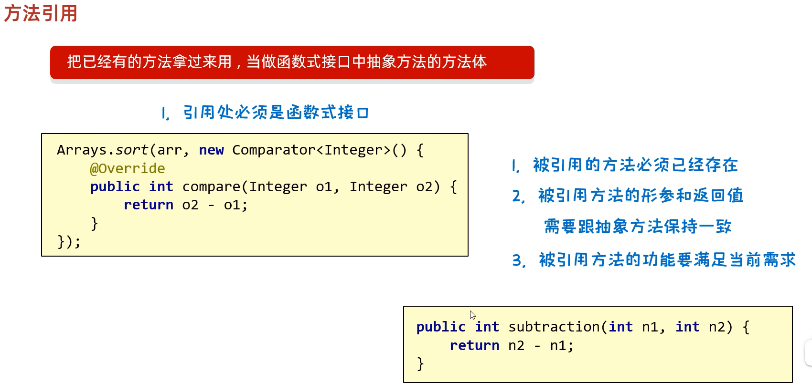
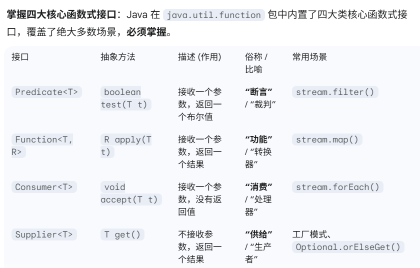
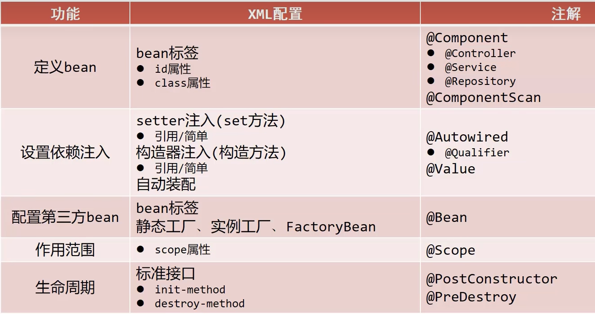
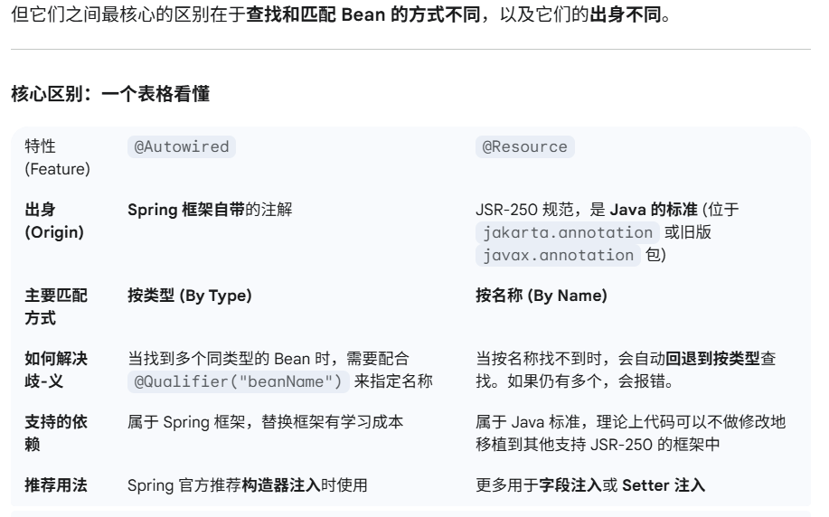
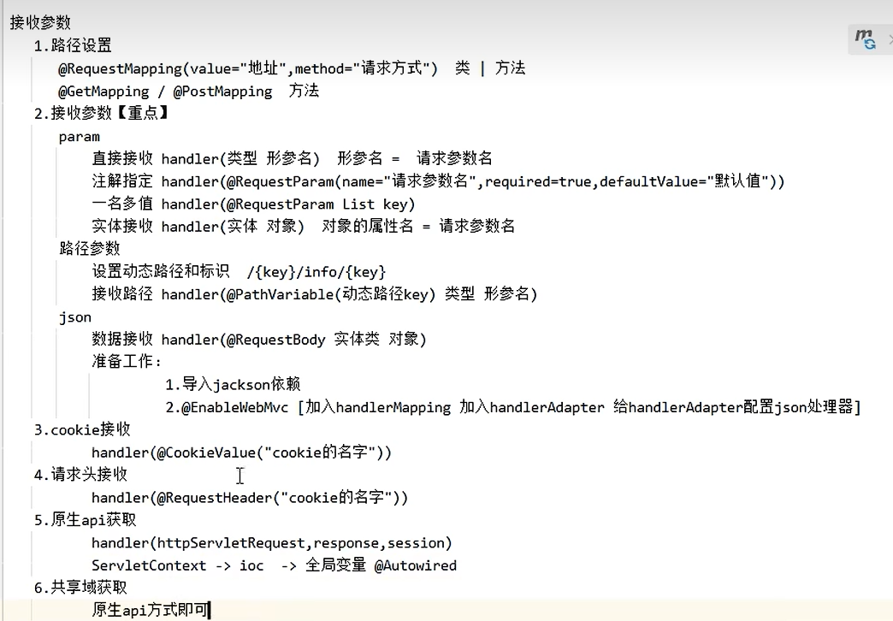
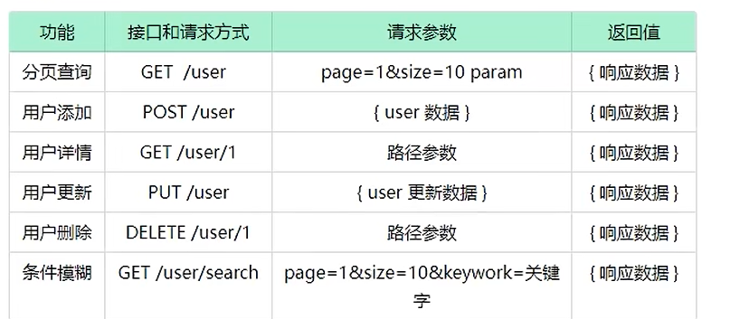

## 一、基础

### 1. String

> 直接赋值会复用字符串常量池中的
>
> new出来不会复用，而是开辟一个新的空间

#### ==和equals

```java
Scanner sc = new Scanner(System.in);
System.out.println("请输入");
String s1 = sc.next();
String s2 = "abc";
System.out.println(s1 == s2);
System.out.println(s1.equals(s2));  //比较字符串的内容
```

#### string相关类

- `char charAt(int index)`：根据索引返回字符
- `StringBulider`类
  - `StringBuilder append(任意类型)`:`sb.append("自动释放").append(12.34).append(true);sb.append("自动释放").append(12.34).append(true);`
  - `StringBuilder reverse()`
  - `int length()`
  - `String toString()`：返回字符转类型
- `StringJoiner`类
  - `StringJoiner add()`
  - `int length()`
  - `String toString()`：返回字符转类型
- `s1.compareTo(s2)` s1>s2 返回 1 ，s2<s2 返回 -1，s1=s2 返回0
- `string.format`

### 2. Array

#### 数组默认初始化规律

- `new int[100]`：0

- `new float[N]`：0.0

- `new char[N]`：'/u0000' 空格

- `boolean f[N]`：false

- 引用数据类型：null

```java
// 数组初始化方式
int[] arr= new int[]{1,2,3};
int[] arr2 = {1,2,3};
int[] arr3 = new int[100];
```

#### java内存分配

- 从程序主入口开始（main），每遇到一个命令，就压入栈。
- 当程序遇到创建对象的操作`int[] arr = new int[]{1,2,3};`，就在堆中开辟一段空间存入，此时变量存入的是堆内存中的地址值。
  1. 只要是new出来的一定是在堆里面开辟了一个小空间
  2. 如果new了多次，那么在堆里面有多个小空间，每个小空间中都有各自的数据
  3. 当两个数组指向同一个小空间时，其中一个数组对小空间中的值发生了改变，那么其他数组再次访问的时候都是修改之后的结果了。

1. **栈：方法运行时使用的内存比如main方法运行，进入方法栈中执行**
2. **堆：new来创建的，都存储在堆内存**

### 3. Method

> 方法是程序中执行最小的一个单元

#### 重载

- 同一个类中定义的**多个同名方法**，这些同名方法具有同种功能；每个方法有**不同的参数类型**或**参数个数**
- 同一个类中：方法名相同，参数不同（个数不同，类型不同，顺序不同），返回值**可以**不同

#### 重写

- 在继承中，子类重写父类的同名方法（因为父类的方法不能满足要求）
- 子类重写方法上面需要，使用`@Override`注解表示重写
  - 重写的方法名称、形参列表必须与父类一样
  - 能够继承的方法才能够重写，比如父类私有的方法，静态方法，final修饰的方法，不能被继承和重写


### 4. 数据类型

#### 基本数据类型

> 变量存储的是真实值，在方法中使用基本数据类型传参使，传递的是值（值传递）

- 整数：`byte/short/int(4个字节,10位数)/long(8个字节,19位数)`
  - 如果要定义1ong类型的变量，需要在数据值的后面需要加一个`L`为后缀：`long a = 999999L;`
- 浮点数：`float(4个字节)/double(8个字节)`
- 字符：`char`：0-65535
- 布尔：`boolean`

#### 引用数据类型

> 变量存储的是地址值，所以说在方法中使用引用数据类型传参使，传递的是地址（地址传递）

### 5. 对象

#### 构造方法

1. **方法名与类名相同**，大小写也要一致，它的作用使给成员变量初始化的。
2. **没有返回值也没有返回类型(**不能由retrun带回结果数据)
3. 执行时机：
   - 创建对象的时候由虚拟机调用，不能手动调用构造方法
   - 每创建一次对象，就会调用一次构造方法
4. 构造方法可以**重载**
5. 无论是否使用，都手动书写**无参数构造方法，和带全部参数的构造方法**
   - 无参构造，成员变量的值都是默认值，可以看上文的数组初始化规律

```java
public class Person {
    // 成员变量
    String name;
    int age;
    public Person(){}
    public Person(String name,int age) {
        this.name = name;
        this.age = age;
    }
    public void call() {
        // 局部变量，this 特指成员变量
        int a = 10;
        System.out.println(this.name+"今年要发论文啦！"+"但是已经"+this.age+"岁了。");
    }
}

```

#### 标准的JavaBean类

> javabean类：用来描述一类事务的类。比如，Student,Teacher,Cat等
>
> 测试类：用来检查其他的类是否编写正确，带有main方法的类，是程序的入口
>
> 工具类：不是用来描述事物，而是

1. IDEA插件**Ptg**

2. 标准的JavaBean类

   - 类名需要见名知意

   - 成员变量使用private修饰
     - 至少提供两个构造方法
       - 无参构造
       - 带全部参数的构造

   - 成员方法
     - 提供每个成员对应的get/set
       - 如果还有其他行为，都要写上

#### static关键字

> 被static修饰的成员变量，叫做静态变量，调用方式：使用类名调用
>
> - 静态方法中只能访问静态，没有this。因为静态代表的是一种共享的概念
>
> - 非静态方法可以访问所有，有this，也能访问到共享数据（静态变量）

1. 静态变量：

   - 被所有对象共享，不属于对象，属于类

   - **随着类加载而加载（`Student.teacner='mygo'`），优先于对象存在。因为只有new出现，对象才出现**


2. 静态方法

   - 常用在测试类和工具类中，Javabean类中很少会使用

   - **随着类加载而加载（`Student.teacner='mygo'`），优先于对象存在**。不用new对象，类加载后就可以使用静态方法


####  继承

格式：`public class Student extends Person{}`

1. 特点

   - 子类可以继承父类的属性和行为，子类可以在父类的基础上增加其他功能

   - java只支持单继承，不支持多继承

2. 子类能够继承父类什么东西呢

   - 所有成员变量

   - 非静态方法，非私有方法，非final方法，非构造方法

3. 父类构造方法

   - 父类的构造方法不会被继承，但是可以通过`super`进行调用
   - 子类构造器内部，默认执行`super()`

#### 多态

格式:`Person P = new Student()`

```java
Animal a = new Cat01();
a.cgy = "猫和狗";
System.out.println(a.cgy);
/*
调用成员变量
编译看左边：看左边的父类是否有这个成员变量
运行看左边：实际与运行的是父类中的成员变量
因为在子类会继承父类的变量
* */
System.out.println(a.cgy);
/*
用成员方法
编译看左边： 看左边的父类是否有这个方法，如果有编译成功，没有就报错
运行看右边： 运行时，实际上是运行的子类重写父类的方法，如果没有重写，就运行父类的方法
因为子类中重写父类的方法，此时就会运行重写的
*/
a.eat();

/*
多态的弊端：不能调用子类的特有功能
报错的原因？
不能使用子类特有的功能，因为在编译的时候会先检查左边的父类中有没有这个方法，如果没有直接报错。
*/
//解决方法，强制类型转换，转换成子类。a instanceof b = a对象 是不是 b类型
if(a instanceof Animal) {
    Cat01 c = (Cat01)a;
    c.catchMouse();
}
```

#### 包

包名字规则：域名反写+包的作用，全部英文小写：com.syr.domain

#### final关键字

表示最终的，不能被改变的，类似于c中的const

- final修饰后：方法不能被重写、类不能被继承、变量叫做常量只能赋值一次

#### 抽象类

抽象方法：`public abstract void method();`

抽象类：`public abstract class Person{}`

1. 抽象类不能实例化，不能创建对象，但可以有构造方法
2. 抽象类中不一定要有抽象方法，有抽象方法的类一定是抽象类
3. 抽象类的子类
   - 必修重写抽象类的所有抽象方法
   - 或者子类也是个抽象类

#### 接口

定义：`public interface USB{}`

1. 接口类不能实例化，没有构造方法，但可以继承
   - 变量声明：`public static final a`
   - 方法声明：只能是抽象方法，`public abstract void method(){};`
2. 接口和类是实现关系，`public class charge implements USB{}`
3. 接口的子类（实现类）
   - 必须重写接口里面的所有抽象方法
   - 或者实现类本事就是抽象类

- 注意1：接口和类之间是实现关系，可以多个实现，`public class A implements USB1,USB2 {}`
- 注意2：继承一个类的同时实现多个接口。`public A extent B implements USB1,USB2{}`

- 注意3：接口之间可以多继承

JDK8新特性

- 允许在接口中定义默认方法``public default void show``
  - 默认方法不是抽象方法，允许实现类不用强制重写。但如果重写就要去掉default关键字
  - public可以省略，default不能省略

#### 内部类

### 6. 常用API

```java
/*
包装类：用一个对象，把基本数据类型包起来
Integer

Arrays接口
toString()
copyOf()
fill()
sort()
*/
Integer i = 10; //不需要new,直接赋值就是包装类对象
String str = Arrays.toStrings(arr) //把数组拼接成一个字符串
int [] newArr = Arrays.copyOf(arr,len) //将旧数组的len长度拷贝到新数组中
int [] newArr = Arrays.fill(arr,val)  //填充数组，val值
int [] newArr = Arrays.sort(arr)   //对数组进行排序
/*
1.只能对引用数据类型的数组进行排序（需要变成包装类）
2.第二个参数是一个接口，需要传递这个结构的实现类对象，直接采取匿名内部类的方式
*/
Arrays.sort(arr,new Comparator<Integer>(){
    @Override
    public int compare(Integer o1, Integer o2) {
        return o1-o2; //升序，o2-o1：降序
    }
});
```


## 二、集合

### 2.1 Collection

> 集合的祖宗接口，它的功能是全部单列集合都可以继承使用的

```java
/*
java.util
├── Iterable (所有集合类的顶级接口)
│
└── Collection (接口) - 单个元素的集合
    ├── List (接口) - 有序，可重复
    │   ├── ArrayList (类) - 数组实现，查询快，增删慢
    │   ├── LinkedList (类) - 链表实现，增删快，查询慢
    │
    ├── Set (接口) - 不可重复
    │   ├── HashSet (类) - 基于 HashMap，无序
    │   ├── LinkedHashSet (类) - 维护插入顺序
    │   └── SortedSet (接口)
    │       └── TreeSet (类) - 可排序
    │
    └── Queue (接口) - 队列，先进先出 (FIFO)
        ├── LinkedList (类) - 也实现了 Deque 接口
        ├── PriorityQueue (类) - 优先队列，
        └── Deque (接口) - 双端队列
            ├── ArrayDeque (类)
            └── LinkedList (类)

└── Map (接口) - 键值对的集合
    ├── HashMap (类) - 数组+链表+红黑树实现，无序
    ├── LinkedHashMap (类) - 维护插入顺序
    ├── Hashtable (类) - 线程安全的 HashMap (已过时)
    └── SortedMap (接口)
        └── TreeMap (类) - 可按键排序
*/
HashMap JDK 8 以后是“数组+链表+红黑树”。当链表长度超过阈值（默认为8）且数组长度超过64时，链表会转换为红黑树，以优化查询性能。


```

### 2.2 常见方法

```java
/*
注意：
Collection是一个接口，不能直接创建他的对象，只能创建它实现类的对象
细节1：在List系列集合中添加数据，永远返回true。
细节2：在Set系列集合中添加数据，如果该数据不存在则返回true，否则返回true
细节3：面向接口编程（如List 接口），后续可灵活切换 List 的实现类（如改用 LinkedList），无需修改依赖 List 接口的代码：
List<String> list = new AList<>(); // 只需修改实例化的地方
List<String> list = new LinkedList<>(); // 只需修改实例化的地方
*/
 
//常见方法
boolean add(E e);
void clear();
boolean remove(E e);
boolean contains(Object obj); //判断是否包含
boolean isEmpty();
int size();

//集合遍历
//1.迭代器遍历
ArrayList<Integer> list = new ArrayList<>();
list.add(1);
list.add(34);
Iterator<Integer> it = list.iterator();
while(it.hasNext()) {
    Integer i = it.next();
    System.out.print(i+" ");
} 
//2.增强for遍历
ArrayList<String> list2 = new ArrayList<>();
list2.add("远坂凛");
list2.add("星空凛");
for(String s:list2) {
    System.out.print(s+" ");
}
//3.匿名内部类
list2.forEach(new Consumer<String>() {
    @Override
    public void accept(String s) {
        System.out.println(s);
    }
});
//4.lambda遍历
list2.forEach(s -> System.out.println(s));
```


### 2.3 Set

#### 2.3.1 HashSet

- hashset底层采用哈希表存储

特点

1. 如果没有重写`hashCode`方法，不同的对象计算出来的哈希值是不同的
2. 如果已经重写了`hashCode`方法，不同的对象只要属性相同，计算出来的哈希值就是一样的
3. 小概率会发生哈希冲突

```java
@Override
public boolean equals(Object o) {
    if (this == o) return true;
    if (o == null || getClass() != o.getClass()) return false;
    Student student = (Student) o;
    return age == student.age && Objects.equals(name, student.name);
}

@Override
public int hashCode() {
    return Objects.hash(name, age);
}
```

```java
public class Main {
    public static void main(String[] args) {
        Student s1 = new Student("SYR",23);
        Student s2 = new Student("SYR",23);
        Student s3 = new Student("玉子",19);
        Student s4 = new Student("anoa",18);

        HashSet<Student> hs = new HashSet<>();

        System.out.println(s1.hashCode());  //2561708
        System.out.println(s2.hashCode());  //2561708

    }
}
```


#### 2.3.2 TreeSet比较方法

---

##### 1. compareTo自然排序
```java
// 实现 Comparable 接口，定义自然排序规则（按学号升序）
public class Student implements Comparable<Student> {
    private int id;
    private String name;
    private int age;

    public Student(int id, String name, int age) {
        this.id = id;
        this.name = name;
        this.age = age;
    }

    @Override
    public int compareTo(Student other) {
        // 按学号升序排序（避免整数溢出）
        return Integer.compare(this.id, other.id);
    }

    @Override
    public String toString() {
        return "Student{id=" + id + ", name='" + name + "', age=" + age + "}";
    }

    public static void main(String[] args) {
        List<Student> students = new ArrayList<>();
        students.add(new Student(3, "Alice", 20));
        students.add(new Student(1, "Bob", 22));
        students.add(new Student(2, "Eve", 19));

        // 直接使用自然排序（无需显式指定 Comparator）
        Collections.sort(students);

        System.out.println("按学号排序结果：");
        students.forEach(System.out::println);
        // 输出：
        // Student{id=1, name='Bob', age=22}
        // Student{id=2, name='Eve', age=19}
        // Student{id=3, name='Alice', age=20}
    }
}

```

**返回值规则**

- **负数**：当前对象 **小于** 参数对象（排序时排在前面）。
- **零**：当前对象 **等于** 参数对象（视为重复，某些集合会去重）。
- **正数**：当前对象 **大于** 参数对象（排序时排在后面）。

##### 2. Comparator比较器排序

```java
public class StudentSorter {
    public static void main(String[] args) {
        List<Student> students = new ArrayList<>();
        students.add(new Student(3, "Alice", 20));
        students.add(new Student(1, "Bob", 22));
        students.add(new Student(2, "Eve", 19));

        // 使用 Comparator 定义自定义排序规则（按年龄降序）
        Comparator<Student> ageComparator = new Comparator<Student>() {
            @Override
            public int compare(Student s1, Student s2) {
                return Integer.compare(s2.age, s1.age); // 降序
            }
        };

        // 或使用 Lambda 简化（Java 8+）：
        // Comparator<Student> ageComparator = (s1, s2) -> Integer.compare(s2.age, s1.age);

        // 显式传入 Comparator 进行排序
        Collections.sort(students, ageComparator);

        System.out.println("按年龄降序排序结果：");
        students.forEach(System.out::println);
        // 输出：
        // Student{id=1, name='Bob', age=22}
        // Student{id=3, name='Alice', age=20}
        // Student{id=2, name='Eve', age=19}
    }
}
```

##### 3. Comparable 和 Comparator比较

| **特性**     | **`Comparable`**          | **`Comparator`**                     |
| ------------ | ------------------------- | ------------------------------------ |
| **接口位置** | `java.lang.Comparable`    | `java.util.Comparator`               |
| **用途**     | 定义对象的**自然排序**    | 定义**自定义排序**或多种排序规则     |
| **实现方式** | 对象自身实现 `Comparable` | 单独定义比较器类或使用 Lambda        |
| **方法**     | `compareTo(T o)`          | `compare(T o1, T o2)`                |
| **调用场景** | `Collections.sort(list)`  | `Collections.sort(list, comparator)` |

```java
List<Student> students = Arrays.asList(
    new Student("Tom"),
    new Student("Anna"),
    new Student("John")
);

Collections.sort(students); // student类重写方法后，调用sort按姓名长度和字典序排序
System.out.println(students); // 输出 [Tom, Anna, John]
```

- **`Comparable`** 用于定义类的**默认自然顺序**，是类的固有属性，简洁且语义明确。
- **`Comparator`** 用于定义**灵活的自定义排序**，支持多规则、外部扩展和复杂逻辑。
- 二者共存是为了兼顾**默认一致性**和**灵活扩展性**，满足不同场景需求。


### 2.4 Map

#### 2.4.1 HashMap

**特点**

- HashMap都是由key决定的：无序、不重复、无索引
- 依赖`hashCode`和`equals`方法保证键的唯一
- 哈希表+红黑树，遇到哈希冲突时候，进行key对应的value的替换

**常用方法**

```java
V put(k,v);
V remove(k);
void clear();
boolean containsKey();
boolean containsValue();
boolean isEmpty();
int size();
```

**遍历方法**

```java
public class Main {
    public static void main(String[] args) {
        Map<String,String> m = new HashMap<>();

        m.put("3","温秋");
        m.put("2","明夏");
        m.put("1","沐春");
        m.put("4","初冬");
        m.put("99","美梦");
        m.remove("99");

        //第一种遍历方法，map.get(key)
        Set<String> s = m.keySet();
        s.forEach(i -> System.out.println(i+" = "+m.get(i)));
        for (String i : s) {
            System.out.println(i+" = "+m.get(i));
        }

        //第二种遍历方法，通过键值对对象遍历
        Set<Map.Entry<String, String>> entries = m.entrySet();
        for (Map.Entry<String, String> entry : entries) {
            String key = entry.getKey();
            String value = entry.getValue();
            System.out.println(key+" = "+value);
        }

        //第三种遍历方式，
        m.forEach(new BiConsumer<String, String>() {
            @Override
            public void accept(String k, String v) {
                System.out.println(k+","+v);
            }
        });

        //lambda遍历
        m.forEach((k,v)-> System.out.println("lambda:"+k+","+v));

    }
}

```

#### 2.4.2 TreeMap比较方法

### 2.5 Collections工具类

- collections不是集合，而是集合的工具类

```java
boolean addAll(Collection<T> c,T... elements)   //批量添加元素
void shuffle(List<T> list)   //打乱List集合元素顺序
void sort(List<T> list)
void sort(List<T> list,Comparator<T> c)
int binarySearch(List<T> list,T key)
void copy(List<T> l1,List<T> l2)
int fill(List<T> list,T obj)
void max(Collection<T> coll)
void min(Collection<T> coll)
void swap(List<T> list,int i,int j)
```

### 3. Stream流

```java
List<User> users = ...;
List<String> names = users.stream() // 1. 获取流
    .filter(user -> "技术部".equals(user.getDepartment())) // 2. 筛选部门（中间操作）
    .filter(user -> user.getAge() > 25) // 2. 筛选年龄（中间操作）
    .sorted(Comparator.comparing(User::getAge).reversed()) // 2. 按年龄降序（中间操作）
    .map(User::getName) // 2. 提取姓名（中间操作）
    .collect(Collectors.toList()); // 3. 收集成 List（中间操作）
```

1. 创建stream流

   ```java
   //从集合创建
   list1.stream().forEach(s -> System.out.println(s));
   //双列集合创建
   hm.keySet().stream().forEach(s -> System.out.println(s));
   hm.entrySet().stream().forEach(s -> System.out.println(s));
   
   //从数组创建,包括引用类型和基本数据类型
   // 数组，基本数据类型
   int[] a = {1,2,3,4};
   // 数组，引用数据类型
   Integer[] b = {1,2,9,9,9};
   Arrays.stream(a).forEach(s -> System.out.println(s));
   Arrays.stream(b).forEach(s -> System.out.println(s));
   
   //直接创建
   Stream.of("a", "b", "c")
   ```

2. 中间操作

   - tipes1:中间操作，返回新的Stream流，原来的流只能使用一次，建议使用链式编程
   - tipes2:修改stream流中的数据，不会影响原来集合或者数组的数据

   ```java
   //过滤
   Stream<T> filter()
   //获取前num个元素
   Stream<T> limit(num)
   //跳过前num个元素
   Stream<T> skip(num)
   //元素去重，以来hashcode和equals方法
   Stream<T> dsitinct()
   //合并
   Stream<T> concat(Stram a,Stream b)
   //转换流的数据类型
   Stream<T> map()
       
    
   ArrayList<String> l = new ArrayList<>();
   Collections.addAll(l,"周芷若","赵敏","张强","张三丰","张翠山","张良","王二麻子","谢广坤");
   //重写函数
   l.stream().filter(new Predicate<String>() {
       @Override
       public boolean test(String s) {
           // true当前数据留下，false当前数据丢掉
           return s.startsWith("张");
       }
   }).forEach(s -> System.out.println(s));
   
   //lamb 链式编程
   l.stream().filter(s -> s.startsWith("张")).forEach(s -> System.out.println(s));
   ```

3. 终结操作

   ```java
   /*
   void forEach()   便利
   long count()     统计
   toArray()        收集流中的数据，放到数组中
   */
   
   ```

   


## 三、多线程

有两种方法可以创建新的执行线程。

1. 一种是将类声明为Thread的子类，此子类应覆盖类Thread的run方法，然后可以分配和启动子类的实例。

   ```java
   public class ThreadTest extends Thread{
       @Override
       public void run() {
           for(int i=0; i<5; i++) {
               System.out.println("子线程启动");
           }
   
       }
   }
   
   public static void main(String[] args) {
           ThreadTest t = new ThreadTest();
   
           t.start();
   
           for(int i=0; i<100; i++) {
               System.out.println("主线程启动");
           }
   
       }
   ```

2. 实现`Runnable`接口

   - 定义一个线程任务类MyRunnable 实现Runnable接口，重写run方法
   - 创建MyRunnable对象，把MyRunnable任务对象交给Thread线程对象处理
   - 调用线程对象的start() 方法启动线程

   ```java
   public class ThreadTest implements Runnable {
       @Override
       public void run() {
           for(int i=0; i<10; i++) {
               System.out.println("子线程**");
           }
   
       }
   }
   public static void main(String[] args) {
           ThreadTest t = new ThreadTest();
           Thread t2 = new Thread(t);
           t2.start();
           for(int i=0; i<50; i++) {
               System.out.println("主线程");
           }
       }
   ```

   

3. 实现`Callable`接口

   > 前两种线程创建方法有些问题：线程执行完毕后有一些数据需要返回，它们重写的run 方法均不能直接返回结果
   >
   > 实现`Callable`接口的方式的优势在于：可以返回线程执行完毕后的结果

   - 实现callable接口，重写call方法
   - 把callable类型的对象封装成FutureTask(线程任务对象)
   - 


## 知识点

### 静态变量和方法

1. 为什么要在`mian`函数下面使用静态方法
   - `main` 方法是程序的入口点，通常是静态的，因为它在程序启动时直接由 Java 虚拟机（JVM）调用，而无需实例化对象。在 `main` 方法中调用其他静态方法也很方便，避免了创建类实例的额外开销。

2. 静态变量
   - 特点：被该类的所有对象共享
   - 调用方式：类名调用(推荐)、对象名调用
3. 静态方法

4. 在 Java 中，`System.out.println()` 输出的对象不是其内存地址，而是对象的 `toString()` 方法的返回值。当你打印 `s1` 和 `s2` 时，默认会调用 `Student` 类的 `toString()` 方法。


5. 当我们在使用next,nextInt,nextDouble在接收数据的时候，遇到空格，回车，制表符的时候就停止了
   键盘录入的是123123那么此时只能接收到空格前面的数据
   我想要的是接收一整行数据
   约定：
   以后我们如果想要键盘录入，不管什么类型，统一使用**nextLine**
   特点遇到回车才停止

### 函数式接口

> 一个函数式接口（Functional Interface）就是一个**只包含一个抽象方法**的接口。

就这么简单。这个“唯一性”是它的核心特征。

 

### 可变参数

```java
public class Main {
    public static void main(String[] args) {

        int a = getSum(1,2,3);
        System.out.println(a);
    }

    public static int getSum(int ...ages) {
        /*
        * 1.参数中只能写一个可变参数
        * 2.形参中可变参数只能写在最后
        * */
        System.out.println(ages); // ages是一个数组，打印数组是一个地址值
        int sum = 0;
        for(int i : ages) {
            sum += i;
        }
        return sum;
    }
}
```


### 泛型

1. 统一集合中的数据类型
2. 泛型中不能写基本数据类型，因为集合中只能存放引用类型
3. 指定泛型后，可以传递其子类类型（多态）
4. 如果不写泛型，默认是Object

```java
//某个变量的数据类型不确定时，可以使用泛型类
//E表示的是不确定的变量类型，e是形参名
public class A<E> {
    //当方法中的形参不确定时，可以使用类后面定义的泛型<E>
    public boolean add(E e) {
		
    }
}
```

## Spring


### IOC/DI

> 为什么要有这个技术？解耦，业务组件不再需要关心对象的创建、查找等非业务的“杂事”，它可以更专注于实现自身的核心业务逻辑。

#### 原理

1. **IoC (控制反转)** 是一种**设计思想**，目的是**解耦**。它将对象的创建和管理权从我们的代码中转移给了 Spring 的 **IoC 容器**。

2. **Bean** 就是被这个 IoC 容器所管理的**核心对象**，比如我们的 Service 和 Controller。

3.  **DI (依赖注入)** 则是实现 IoC 最核心的**技术手段**。根据bean所依赖的资源在Ioc容器中自动查找并注入到bean中。
   - 识别注入点：寻找被 `@Autowired` 等注解标记的字段、方法或构造函数
   - 查找依赖：根据找到的注入点所需依赖的**类型 (Type)**，去 IoC 容器中查找匹配的 Bean 实例。
   - 最后，容器再次利用**反射**，根据注入方式（字段、Setter或构造函数），将找到的依赖 Bean 实例赋给目标 Bean 的对应属性或作为方法参数传入。

#### 注解



`@Component` ：**为此类创建一个 Bean 定义并注册到 IoC 容器中**。

`@Autowired`：就是 DI 注入，帮助**bean实例**引入其他依赖。将所需的其他 Bean 实例注入进去

**`@Bean`** 用于**显式**的、手动的 Bean 注册。**第三方 Bean** 就是指那些**源代码不由我们控制的、来自于外部依赖（JAR 包）的类**，我们需要将它们的对象实例交由 Spring IoC 容器来管理。

#### Bean

**第一，是 Bean 的‘定义’。** 这部分可以理解为**‘配置文件’**或‘蓝图’。它体现在我们编写的 `@Bean` 方法、`@Component` 注解或者更早期的 XML 配置中。它的作用是**告诉 Spring 容器应该如何去创建一个对象**，包括这个对象的类是什么、它依赖哪些其他对象等等。

**第二，是 Bean 的‘实例’。** 这才是我们通常在程序中使用的**对象**。它是 Spring IoC 容器根据 Bean 的‘定义’（也就是第一步的‘蓝图’），在运行时**真正创建出来的、存在于内存中的对象实例**。

所以，整个流程是：**我们编写 Bean 的‘定义’（配置文件），Spring IoC 容器根据这个‘定义’，为我们创建和管理 Bean 的‘实例’（对象）**。我们通过 `@Autowired` 注入的，就是这个最终的、可直接使用的对象实例。”

**Bean的生命周期**

1. 实例化：Spring 容器根据配置信息（如 `@Component` 注解），通过**反射**机制调用类的构造函数，为 Bean 创建一个**实例对象**。
2. 属性填充：容器开始进行**依赖注入（DI）**。它会检查这个 Bean 依赖了哪些其他的 Bean（通过 `@Autowired` 等注解），然后从容器中找到这些依赖，并设置到当前 Bean 的属性中。
3. 初始化：执行各种回调方法，让这个对象为工作做好“万全准备”的过程。Spring 的 **AOP 代理**也是在初始化阶段的最后完成的，容器会返回一个代理对象而不是原始对象。
4. 销毁

### AOP

> AOP 是一种思想，动态代理是实现这种思想的技术手段。它能够让我们以一种**无侵入**的方式，将通用的事务逻辑“织入”到我们的业务代码中。
>
> 为什么有这个思想？AOP最大的好处是，使我们的业务代码可以完全保持干净，只专注于业务本身，实现了**事务管理逻辑**和**业务逻辑**的彻底解耦，这正是 AOP 的核心价值所在。

1. **AOP (Aspect-Oriented Programming)** 不是要替代 OOP (面向对象编程)，而是它的一个**补充和完善**。

2. AOP提出了一种**思想**：把一些与业务逻辑无关的代码抽离出来，并将它封装成一个独立的模块，这个模块就叫切面 (Aspect)，我们希望在Service每次调用方法前后，都能自动地记录日志和管理事务，但又不能去修改 Service的代码。

3. AOP是基于动态代理实现的，动态代理实现逻辑
   - 调用 -> 代理拦截：当 Controller 调用 Service 的方法时，它实际访问的并不是原始的 UserServiceImpl 对象，而是 Spring 在运行时为它创建的代理对象。我们的调用首先会被这个代理对象拦截下来。
   - 开启事务
   - 执行真实业务：开启事务完成后，代理对象才会去调用**原始的、真实的 `UserServiceImpl` 对象**（那个“CEO”）的业务方法，让它执行真正的核心逻辑
   - (成功则提交 / 异常则回滚)

```java
@Component
@Aspect
public class MyTime {
    @Pointcut("execution(void com.syr.service.BookDao.update())")
    private void p(){}

    @Before("p()")
    public void getTime() {
        System.out.println(System.currentTimeMillis());
    }
}

@SpringBootApplication //1.自己是一个配置类 2.自动加载其他启动配置类(ioc) 3. 扫描当前类所在的包和子包的ioc和di注解
@EnableAspectJAutoProxy
public class Main {
    public static void main(String[] args) {
        // 1. 自动创建ioc容器加载配置
        // 2. 启动内置tomcat服务器
        SpringApplication.run(Main.class,args);

        BookDao b = new BookDaoImpl();
        b.save();
        b.update();
    }
}
```


### 事物

> spring事物作用：在**数据层或业务层**保障一系列的数据库操作 同成功同失败


**`@Transactional`注解**

- 是 Spring 提供的**声明式事务管理**工具。简单来说，你只需要在需要事务的方法或类上加上这个注解，Spring 就会在背后**自动地**为你开启、提交或回滚数据库事务，让你无需编写任何繁琐的事务管理代码。

- `@Transactional` 注解是基于 AOP (面向切面编程) 并利用动态代理实现的。

- 事物的传播行为：`@Transactional(requeires_new)`


## SpringMVC

> 是什么？一种基于JAVA实现MVC模型的轻量级Web框架（做表现层开发的技术框架）
>
> **M** - Model (模型) - **Service 层** 和 **Persistence 层 (Mapper)**
>
> **V** - View (视图) - 前端的**JSON 数据** 
>
> **C** - Controller (控制器)  - **Controller 层**

### 注解

#### `@ResponseBody` 

- 核心作用是**跳过视图解析**，将方法的返回值直接作为**响应体**内容返回。
- 它通过 Spring 的 **`HttpMessageConverter` 机制**来工作，最常见的应用就是将 Java 对象**序列化成 JSON 字符串**。
- **与 `@RestController` 的关系**：`@RestController` 是一个便捷注解，它包含了 `@Controller` 和 `@ResponseBody`，是现代 Spring Boot 开发 RESTful API 的**标准用法**。

#### `@Resource、@Autowired`区别



### 三层架构

1.  **Controller**（表示层）
   - 接受前端请求 ->调用service层的业务逻辑 -> 返回前端的数据
     - **接收并解析**前端的 HTTP 请求。
     - 对请求参数进行**合法性校验**。
     - 调用 `Service` 层处理核心业务逻辑。
     - 捕获业务异常，并将其转换为友好的响应。
     - 将 `Service` 返回的数据**封装**成统一格式（如 JSON），响应给前端。
     - **原则**：保持“薄”，只做请求转发和响应封装，**不包含任何业务逻辑**。
2.  **Service**（业务层）
   - 执行核心业扩逻辑，比如“增删改查”逻辑 -> 调用mapper层来访问数据库 -> 返回...
     - **实现并封装**项目的核心业务规则。
     - 通过**组合、编排**一个或多个 `Mapper` 层的原子操作，来完成一个完整的业务流程。
     - 定义**事务的边界**，确保业务操作的**数据一致性**。
     - **原则**：聚焦业务，不关心底层数据源和前端交互方式。
3.  **Mapper**（持久化层）
   - 负责直接与数据库操作，执行一些具体的sql语句
     - 负责执行具体的 SQL 语句，完成对数据库的**原子性**增删改查（CRUD）操作。
     - 将数据库中的表记录（`ResultSet`）与 Java 的实体对象（`POJO`/`Entity`）进行**相互映射**。
     - **原则**：只做最纯粹的数据读写，**不包含任何业务逻辑**。


### 接收以及相应参数

#### Jason数据接收

@requestMapping：将haddlier(controller)注册到handllermapping

@RequestBody：在controller层中使用`@RequestBody`来接收JSON数据，并将其转化为JAVA对象

@EnableWebMvc`：json处理数据，必须使用此注解，相当于为handlerAdapter配置json转换器

- 添加秘书(handllerMapping)
- 添加经理(handlerAdapter) 
- 给经理添加json转换器

1. 导入json处理依赖（maven）
2. handlerAdapter配置json转换器（`@EnableWebMvc`注解）

#### 参数接收

1. @PathiVariable：路径参数传递
   - @RequestMapping("{account}/{password}")

2. @RequestParam：参数传递注解
   - required = true 默认必须产地
   - defaultValue ，不是必须传递，需要设置默认值
   - value="account" ，可以指定形参对应的参数名

```java
//动态路径  localhost:808:boot/syr/233
@RequestMapping("{account}/{password}")
publci String login(@PathiVariable String account,@PathiVariable String password){
    
}

//  localhost:808:boot?account=syr$password=233
@RequestMapping("")
publci String login(@RequestParam(value="account") String username,
                    @RequestParam(required = false,defaultValue = "1") String password){
    
}
```



### RESTFul接口设计风格



### 参数校验

> **jsr303** 系列注解 

### result类

> `Result` 类的作用就是提供一个标准、统一的数据返回格式。

```javascript
package com.syr.dto;

import lombok.AllArgsConstructor;
import lombok.Data;
import lombok.NoArgsConstructor;

import java.util.List;

@Data
@NoArgsConstructor
@AllArgsConstructor
public class Result {
    private Boolean success;
    private String errorMsg;
    private Object data;
    private Long total;

    public static Result ok() {
        return new Result(true,null,null,null);
    }

    public static Result ok(Object data) {
        return new Result(true,null,data,null);
    }
    public static Result ok(List<?> data,Long total) {
        return new Result(true,null,data,total);
    }

    public static Result fail(String errorMsg) {
        return new Result(false,errorMsg,null,null);
    }
}

```

```json
// 成功时，有数据
{
    "success": true,
    "errorMsg": null,
    "data": { "id": 1, "name": "张三" },
    "total": null
}

// 成功时，有列表和总数（用于分页）
{
    "success": true,
    "errorMsg": null,
    "data": [
        { "id": 1, "name": "张三" },
        { "id": 2, "name": "李四" }
    ],
    "total": 100
}

// 失败时
{
    "success": false,
    "errorMsg": "用户名或密码错误",
    "data": null,
    "total": null
}
```

#### 优点

1. **前后端协作规范**：前端的对接工作变得极其简单和统一。他们总能通过检查 `success` 字段来判断操作是否成功，如果成功就从 `data` 字段取数据，如果失败就从 `errorMsg` 字段获取提示信息。
2. **信息传递更丰富**：除了业务数据 `data`，您还可以方便地携带额外信息，比如用于分页的 `total` 总数，或者其他元数据。
3. **逻辑清晰**：业务成功或失败的状态由 `success` 字段来表示，而不是通过 HTTP 状态码（比如 200, 400, 500）。这样可以做到“通信成功”（HTTP 200）但“业务失败”（`success: false`）。

#### 三个注解

都来自一个名为 **Lombok** 的第三方库。Lombok 的作用是**在编译期自动为您生成样板代码（boilerplate code）**，比如 getter, setter, 构造函数等，从而让您的实体类代码变得极其简洁。

- `@Data`: 这是一个“超级注解”，相当于同时添加了以下几个注解：
  - `@Getter`: 为所有字段自动生成 `get...()` 方法。
  - `@Setter`: 为所有字段自动生成 `set...()` 方法。
  - `@ToString`: 自动生成一个 `toString()` 方法，方便打印对象内容进行调试。
  - `@EqualsAndHashCode`: 自动生成 `equals()` 和 `hashCode()` 方法，用于比较对象是否相等。
  - `@RequiredArgsConstructor`: 为 `final` 或 `@NonNull` 的字段生成一个构造函数。 **作用**：有了它，您就不需要在类里面手动写一大堆 `getXxx()` 和 `setXxx()` 方法了，代码非常干净。
- `@NoArgsConstructor`:
  - **作用**：自动生成一个**无参构造函数**。
  - **为什么需要？** 很多框架（比如 Spring, Jackson, JPA）在进行反序列化或创建代理对象时，需要一个无参构造函数。加上这个注解可以保证兼容性。

- `@AllArgsConstructor`:
  - **作用**：自动生成一个包含**所有字段的构造函数**。
  - **为什么需要？** 您可以看到，在 `Result` 类内部的 `ok()` 和 `fail()` 方法中，就使用了 `new Result(...)` 来创建实例。这个注解就是为了给这些内部方法提供全参数的构造函数。

#### 静态工厂方法

您觉得奇怪的 `public static Result ok(...)` 和 `public static Result fail(...)` 写法，是一种非常优秀的设计模式，叫做 **“静态工厂方法” (Static Factory Method**

## Springboot

###  起步依赖

1. **spring-boot-starter-parent** -> spring-boot-dependencies -> `<properties>`/`<dependencyManagement>`

   - `<properties>`配置着依赖版本信息

   - `<dependencyManagement>` 配置着各种依赖
   - 这些在`<parent>`标签里配置的依赖都不会直接引入，只是声明版本，后面只需要导入名称即可

2. **spring-boot-starter-web**：SpringMVC的依赖

3. **spring-boot-starter-test**：Spring的依赖


`@SpringBootConfiguration` 继承自 `@Configuration`，它首先表明这个类是一个 Spring 的配置类源，Spring 容器可以从这里加载 Bean 的定义。”

`@EnableAutoConfiguration` 的核心职责是**激活 Spring Boot 的自动配置机制**。它本身并不直接“加载文件”，而是作为一个开关，去触发 Spring Boot 的一套智能装配流程：

自动配置类的主要作用是**“定义和注册 Bean”**到 IoC 容器中。而依赖注入（DI）是 IoC 容器在所有 Bean 都被定义后，进行“组装”的那个步骤。

“`@ComponentScan` 负责定义一个扫描路径，让 Spring IoC 容器能够找到我们自己编写的、被 `@Component` 或其衍生注解标记的业务组件（如 Controller, Service），并将它们注册为 Bean 定义。它的默认扫描路径是主启动类所在的包及其子包。”

### 配置文件


## MYSQL

### 事物

#### 四大特性：

- 原子性：事务是最小操作单元，要么全部执行成功、要么全部失败**回滚**
- 一致性：事务执行前后，数据库的数据都必须处于一个**合法的**的状态。
- 隔离性：多个并发事务同时操作数据库时，一个事务的执行不应被其他事务干扰，事务之间应该**相互隔离**。
- 持久性：事务一旦执行，对数据库中的数据的改变是永久的

#### 并发事务问题

## Redis

对于一个使用 Spring/Spring Boot 的 Java 开发者来说，掌握 Redis 的程度可以分为三个层次。**通常，达到“熟练应用”层次就足以应对绝大多数工作。**

### 层次一：基础

这是日常开发必须具备的知识，否则很容易用错或用不好 Redis。

1. **理解 Redis 的本质**
   - 知道它是一个**基于内存**的、单线程模型的 Key-Value 数据库。
   - 理解它为什么快（内存操作、I/O 多路复用）。
2. **熟练使用五种基本数据类型**
   - `String`: 缓存对象、计数器、分布式锁。
   - `Hash`: 缓存对象的**部分属性**，避免序列化整个大对象。例如，一个用户的多个字段，可以只更新其中一个。
   - `List`: 消息队列（FIFO）、文章列表、粉丝列表。
   - `Set`: 去重、标签、共同好友、抽奖。
   - `Sorted Set (ZSet)`: 排行榜、带权重的任务队列。
   - **核心要求**：能根据业务场景，选择最恰当的数据结构，而不是把所有东西都序列化成 JSON 字符串存到 `String` 类型里。
3. **掌握核心概念和命令**
   - `Key` 的设计和命名规范。
   - `TTL`（Time To Live）：熟练设置和管理过期时间，这是缓存的核心。
   - 了解最常用的命令，如 `SET/GET`, `HSET/HGET/HGETALL`, `LPUSH/RPOP`, `SADD/SMEMBERS`, `ZADD/ZRANGE` 等。
4. **Java 中的配置与使用**
   - 能够在 Spring Boot 中正确配置 Redis 连接（host, port, password, database）。
   - 理解并会配置 `RedisTemplate` 的**序列化器**（特别是把默认的 JDK 序列化改成 JSON）。
   - 熟练使用 `redisTemplate.opsForValue()`、`opsForHash()` 等。


### 层次二：熟练应用

具备这些知识，说明你能在生产环境中可靠、高效地使用 Redis。

1. **理解 Redis 持久化**
   - 了解 `RDB` 和 `AOF` 两种持久化方式的原理、优缺点和适用场景。
   - 知道它们如何影响数据安全性和 Redis 性能。
2. **解决缓存经典问题**
   - **缓存穿透**：是什么？如何用布隆过滤器或缓存空对象解决？
   - **缓存击穿**：是什么？如何用互斥锁或逻辑过期解决？
   - **缓存雪崩**：是什么？如何通过设置随机过期时间、多级缓存或限流降级来解决？
3. **了解进阶功能**
   - **事务**：了解 `MULTI/EXEC`，知道 Redis 事务的局限性（不保证原子性回滚）。
   - **发布/订阅 (Pub/Sub)**：了解其基本模型，可用于简单的消息通知。
   - **Pipeline (管道)**：知道它可以批量发送命令，显著提升性能，减少网络往返时间。

### 层次三：进阶精通

这部分通常是架构师或资深开发者需要深入研究的领域。

1. **高可用与可扩展架构**
   - **主从复制 (Master-Slave)**：理解其原理和数据同步过程。
   - **哨兵模式 (Sentinel)**：理解它如何实现自动故障转移，保证高可用。
   - **集群模式 (Cluster)**：理解它如何通过分片（Sharding）来横向扩展数据存储和吞吐量。
2. **性能优化与内存管理**
   - 理解 Redis 的内存淘汰策略（`maxmemory-policy`）。
   - 会分析 `INFO` 命令，定位性能瓶颈。
   - 掌握大 Key、热 Key 的发现与处理方法。
3. **理解底层原理**
   - 深入理解 Redis 的单线程事件循环模型。
   - 了解 Lua 脚本，知道如何用它来保证复杂操作的原子性。

**给您的建议：** **首先，牢牢掌握“层次一”的全部内容**，这是你日常工作中最常打交道的部分。然后，**重点学习“层次二”中的缓存三大问题及其解决方案**，这在面试和实际工作中都极为重要。当你在工作中遇到性能瓶颈或需要构建高可用系统时，再去深入研究“层次三”的内容。


## 黑马点评

### 各个文件包的详细作用

现在我们来详细解释您不熟悉的几个包：

#### 1. `entity` (或 `domain`, `model`, `po`) - 实体类包

- **作用**：**专门用来映射数据库中的表**。这个包里的每一个 Java 类，通常都对应着数据库里的一张表，类中的每个属性对应着表里的一个字段。

- **特点**：

  - 通常会使用 JPA 注解（如 `@Entity`, `@Table`, `@Id`）或 MyBatis-Plus 注解（如 `@TableName`, `@TableId`）来建立类与表的映射关系。
  - 它代表了数据在数据库中的最原始形态。

- **比喻**：**食材**。`UserEntity` 类就代表了从 `user` 表里拿出来的一条完整的用户数据。

  

#### 2. `dto` (Data Transfer Object) - 数据传输对象包

- **作用**：**专门用于在不同层之间，特别是后端与前端之间传递数据**。
- **为什么需要它？为什么不直接用 `entity`？** 这是关键！
  1. **安全与隐私**：`entity` 里的字段（比如 `password`, `salt`）通常不应该暴露给前端。DTO 可以只包含需要展示给用户的字段。
  2. **数据聚合**：前端页面上可能需要同时展示来自多张表的数据（比如用户信息和他的订单数量）。DTO 可以将这些信息聚合到一个对象中，方便前端使用。
  3. **API 职责清晰**：API 返回的数据结构应该根据前端的需求来定，而不是被数据库的表结构所束缚。
- **比喻**：**摆盘后的菜品**。厨师（`Service`）用 `UserEntity`（食材）做了一道菜，但最终呈现给顾客的是 `UserDTO`（菜品），它只包含了顾客想看的信息（如用户名、昵称），隐藏了不必要的细节。


#### 3. `config` - 配置包

- **作用**：存放项目的所有**Java 配置类**。在 Spring Boot 中，虽然大部分配置可以通过 `application.yml` 完成，但一些复杂的配置（如集成第三方组件、自定义Web环境等）需要通过 Java 代码来实现。
- **存放内容举例**：
  - `RedisConfig.java`: 配置 Redis 的序列化方式。
  - `MyBatisPlusConfig.java`: 配置 MyBatis-Plus 的分页插件、拦截器等。
  - `WebMvcConfig.java`: 配置 Spring MVC 的拦截器、跨域（CORS）规则等。
  - `SecurityConfig.java`: 配置 Spring Security 的安全认证和授权规则。
- **比喻**：**餐厅的规章制度和装修设计**。


#### 4. `utils` - 工具类包

- **作用**：存放**可重用的、通用的工具类**。这些工具类通常与具体的业务逻辑无关，可以在项目的任何地方被调用。
- **存放内容举例**：
  - `JwtUtils.java`: 用于生成和校验 JWT Token。
  - `DateUtils.java`: 用于处理日期和时间的格式化。
  - `ResultUtils.java` 或 `R.java`: 用于封装统一的 API 响应格式。
  - `HttpUtils.java`: 用于发送 HTTP 请求。
- **特点**：类中的方法通常是静态的（`static`）。
- **比喻**：**厨房的通用工具**（菜刀、锅铲）。


### Mybatis-plus使用教程

好的，非常乐意！掌握 `lambdaQuery()` 及其相关的链式操作，是精通 MyBatis-Plus 的关键。下面我将为您详细地、分门别类地讲解如何使用 Lambda 风格的 API 来完成所有常见的 CRUD（增删改查）操作。


#### **前提准备**

在开始之前，请确保您的项目已经准备好了以下几个部分：

1. **`User` 实体类**: 位于 `com.syr.entity` 包下。
2. **`UserMapper` 接口**: 位于 `com.syr.mapper` 包下，并继承了 `BaseMapper<User>`。
3. **`IUserService` 接口**: 位于 `com.syr.service` 包下，并继承了 `IService<User>`。
4. **`UserServiceImpl` 实现类**: 位于 `com.syr.service.impl` 包下，并继承了 `ServiceImpl<UserMapper, User>`。

我们所有的操作都将在 `UserServiceImpl.java` 文件中进行演示。


#### `C` - Create (新增数据)

新增操作通常比较简单，`ServiceImpl` 自带的 `save` 或 `saveBatch` 方法已经足够强大，一般无需动用 `Wrapper`。

##### 新增数据

直接使用 `save()` 方法。

```java
@Override // 假设在 IUserService 中定义了该方法
public boolean createUser(User user) {
    // IService 提供的 save 方法，插入成功返回 true，失败返回 false
    // 它会自动处理 ID 的回填（如果主键是自增的）
    return save(user);
}
```

##### 批量新增

如果有效率要求，需要一次性插入多条数据，请使用 `saveBatch()`。

```java
@Override
public boolean createUsers(List<User> userList) {
    // 批量保存，效率远高于循环调用 save()
    return saveBatch(userList);
}
```

------


#### `R` - Read (查询数据) 

> 查询操作是 `lambdaQuery()` 最核心、最强大的应用场景。

##### 查询单个实体 (`.one()`)

```java
/**
 * 根据手机号精确查找用户
 */
public User findByPhone(String phone) {
    return lambdaQuery()
            .eq(User::getPhone, phone) // WHERE phone = ?
            .one(); // .one() 会查询并返回单个对象，如果结果超过1个会报错
}
```

#####  查询实体列表 (`.list()`)

```java
/**
 * 查询所有状态正常且按创建时间降序排序的用户
 */
public List<User> findActiveUsers() {
    return lambdaQuery()
            .eq(User::getStatus, 1) // WHERE status = 1
            .orderByDesc(User::getCreateTime) // ORDER BY create_time DESC
            .list(); // .list() 会查询并返回一个 List 集合
}
```


##### 3. 组合复杂条件查询


`lambdaQuery()` 支持丰富的条件，您可以像搭积木一样把它们串联起来。

Java

```
/**
 * 查找昵称包含 "张" 并且年龄大于等于 20 岁的用户
 */
public List<User> findUsersByComplexCondition(String keyword, Integer minAge) {
    return lambdaQuery()
            .like(User::getNickName, keyword) // WHERE nick_name LIKE '%张%'
            .ge(User::getAge, minAge)         // AND age >= 20  (ge = Greater or Equal)
            .list();
}
```

**常用条件:**

- `.eq()`: 等于 (`=`)
- `.ne()`: 不等于 (`!=`)
- `.gt()`: 大于 (`>`)
- `.ge()`: 大于等于 (`>=`)
- `.lt()`: 小于 (`<`)
- `.le()`: 小于等于 (`<=`)
- `.like()`: 模糊查询 (`LIKE`)
- `.in()`: 范围查询 (`IN`)
- `.isNull()`: 为空 (`IS NULL`)
- `.isNotNull()`: 不为空 (`IS NOT NULL`)
- `.orderByAsc()` / `.orderByDesc()`: 排序


##### 4. 统计查询 (`.count()`)


Java

```
/**
 * 统计所有状态为禁用的用户数量
 */
public long countDisabledUsers() {
    return lambdaQuery()
            .eq(User::getStatus, 0) // WHERE status = 0
            .count(); // .count() 只查询数量，不查询数据，效率高
}
```


##### 5. 分页查询 (`.page()`)


分页查询是企业级项目中必不可少的功能。

前提：您必须先配置分页插件！

请在您的 config 包下创建一个 MybatisPlusConfig 类，并添加如下配置：

Java

```
package com.syr.config;

import com.baomidou.mybatisplus.annotation.DbType;
import com.baomidou.mybatisplus.extension.plugins.MybatisPlusInterceptor;
import com.baomidou.mybatisplus.extension.plugins.inner.PaginationInnerInterceptor;
import org.springframework.context.annotation.Bean;
import org.springframework.context.annotation.Configuration;

@Configuration
public class MybatisPlusConfig {
    @Bean
    public MybatisPlusInterceptor mybatisPlusInterceptor() {
        MybatisPlusInterceptor interceptor = new MybatisPlusInterceptor();
        // 添加分页插件
        interceptor.addInnerInterceptor(new PaginationInnerInterceptor(DbType.MYSQL));
        return interceptor;
    }
}
```

**分页查询示例代码：**

Java

```
import com.baomidou.mybatisplus.extension.plugins.pagination.Page;

/**
 * 分页查询用户
 * @param pageNum  当前页码
 * @param pageSize 每页数量
 * @return 分页结果对象
 */
public Page<User> findUsersByPage(int pageNum, int pageSize) {
    // 1. 创建 Page 对象，传入当前页码和每页数量
    Page<User> page = new Page<>(pageNum, pageSize);

    // 2. 调用 .page() 方法，它会执行分页
    //    第一个参数是 Page 对象，第二个参数是 QueryWrapper (可以为 null)
    //    这里我们直接用 lambdaQuery() 的链式调用
    lambdaQuery()
        .orderByDesc(User::getCreateTime)
        .page(page); // 执行分页查询，结果会自动封装到传入的 page 对象中

    // 3. 返回 Page 对象，它里面包含了总记录数、总页数、当前页数据列表等所有信息
    return page;
}
```

------


#### **`U` - Update (更新数据)**

##### **1. 根据 ID 更新**

直接使用 `updateById()`，它非常智能，**只会更新实体中不为 null 的字段**。

Java

```
/**
 * 根据ID更新用户信息
 * @param user 只需要传入 ID 和需要修改的字段
 */
public boolean updateUser(User user) {
    // 例如，如果 user 对象中只有 id 和 nickName 有值，
    // 那么这条语句最终生成的 SQL 只会是：UPDATE tb_user SET nick_name = ? WHERE id = ?
    // 不会影响其他字段，非常安全。
    return updateById(user);
}
```


##### **2. 根据条件更新 (`lambdaUpdate()`)**


当您需要执行 `UPDATE ... WHERE ...` 这样的语句时，使用 `lambdaUpdate()`。

Java

```
/**
 * 将所有未成年用户的状态更新为“受限”
 */
public boolean restrictMinors() {
    return lambdaUpdate()
            .lt(User::getAge, 18) // WHERE age < 18
            .set(User::getStatus, 2) // SET status = 2
            .update(); // 执行更新
}
```

------


#### `D` - Delete (删除数据)

##### 1. 根据 ID 删除

最简单的方式，使用 `removeById()`。

```java
public boolean deleteUserById(Long id) {
    return removeById(id);
}
```

##### 2. 根据条件删除

删除操作也由 `lambdaUpdate()` 链来发起，最后调用 `.remove()` 结尾。

```java
/**
 * 删除所有状态为“已注销”的用户
 */
public boolean removeInactiveUsers() {
    return lambdaUpdate()
            .eq(User::getStatus, 3) // WHERE status = 3
            .remove(); // 执行删除
}
```

希望这份详细的指南能帮助您完全掌握 MyBatis-Plus Lambda 的强大功能！祝您在周五下午的编程时光里，编码愉快，一切顺利！

### 重要注解作用

#### @Transactional

> `@Transactional` 注解是声明式事务管理的核心，它能够确保一组数据库操作要么全部成功，要么在出现任何错误时全部回滚，从而保障数据的原子性、一致性、隔离性和持久性（ACID 原则）。简而言之，此注解极大地简化了开发人员对数据库事务的控制，让开发者可以更专注于业务逻辑的实现。

主要作用是为方法或类提供事务支持。当一个方法被此注解标记后，Spring Boot 会在方法执行前自动开启一个数据库事务。如果方法成功执行完毕，事务将被提交，所有数据库更改将永久保存。如果在方法执行过程中抛出了未被捕获的运行时异常（RuntimeException）或错误（Error），事务将自动回滚，所有已经执行的数据库操作都将被撤销，就像从未发生过一样。

**工作原理**

- **基于 AOP 和动态代理**：Spring 在运行时，会对声明了 `@Transactional` 的 Bean 创建一个代理对象，而不是直接使用原始对象。我们后续的所有调用，实际上都是通过这个代理对象来完成的，事务的管理能力就是由这个代理对象提供的。
- AOP 是一种编程思想，而动态代理是实现这种思想的一种主流技术手段。
- AOP是一种思想，目的是将通用功能和业务逻辑解耦。而动态代理是Spring实现AOP思想的核心技术。Spring通过动态代理在运行时创建一个代理对象，将事务、日志等切面逻辑织入到这个代理对象中，从而在不侵入业务代码的前提下，实现了功能的增强。

### 用户登录

1. 为什么在登陆的时候，要将用户信息保存在session中呢？

   - **核心问题：HTTP 协议是“无状态”的 (Stateless)。**

   - “无状态”指的是，每一次 HTTP 请求（比如刷新页面、点击链接）都是完全独立的。服务器默认不会记得你上一次请求做了什么。这就好像一个记忆只有7秒的店员，你第一次告诉他你是谁，第二次去找他，他已经完全不认识你了
   - 这对于需要“登录”的应用来说是致命的。用户登录成功后，下一次刷新页面，服务器就会忘记他的登录状态，要求他重新登录。

2. 为什么后来又用 Redis 代替 Session？

   - Session 方案在单个服务器上运行得非常完美。但是，当网站流量越来越大，一台服务器扛不住，需要部署**多台服务器**（集群）时，Session 的弊端就暴露无遗了。
   - **核心问题：默认的 Session 存在单台服务器的内存里，无法在多台服务器之间共享。**
   - 优点
     - **轻松实现水平扩展 (Scalability)**：无论后端有多少台应用服务器，它们都共享同一个 Redis 来存取登录状态，可以自由地增加或减少服务器数量。应用服务器本身变成了**无状态**的，这对于构建大型分布式系统至关重要。
     - **高性能 (High Performance)**：Redis 数据存储在内存中，读写速度极快，远胜于传统的基于磁盘的 Session 存储。
     - **高可用 (High Availability)**：Redis 本身支持集群和持久化，可以保证即便是单台应用服务器或 Redis 节点宕机，用户的登录状态也不会丢失。
     - **解耦**：将用户的会话状态与应用服务器本身解耦，使得系统架构更清晰、更灵活。

3. 为什么要使用threadlocal？

   存threadlocal 里面是因为在某些业务操作的时候需要获取当前用户信息 并做记录 插入到数据库，就不需要请求传入request获取requet里面header里面的token 信息，再解析出来了

## redis缓存

缓存穿透：是指请求的数据不在redis也不在数据库中，这些请求都会到达数据库中，会造成多次垃圾访问

### 添加商铺缓存


```java
  public Result getById(Long id) {
      // 1.从redis查商铺缓存
      String shopJson = stringRedisTemplate.opsForValue().get(CACHE_SHOP_KEY + id);
      // 2.判断redis中是否存在
      if(StrUtil.isNotBlank(shopJson)) {
          // 3.存在，直接返回  
          Shop shop = JSONUtil.toBean(shopJson, Shop.class);
          return Result.ok(shop);
      }
      // 4.不存在，根据id去数据库查，如果数据库没有，返回错误
      Shop shop = lambdaQuery().eq(Shop::getId, id).one();

      if(shop == null) {
          return Result.fail("商铺不存在！");
      }
      // 5.数据库存在，写入redis，并设置过期时间
      stringRedisTemplate.opsForValue().set(CACHE_SHOP_KEY + id, JSONUtil.toJsonStr(shop),CACHE_SHOP_TTL, TimeUnit.MINUTES);

      return Result.ok(shop);
  }
```

### 缓存穿透


## java新特性

### java8

1. **Lambda 表达式 (Lambda Expressions):** 这是 Java 8 最核心的特性之一。它允许我们将函数作为方法的参数，或者将代码看作数据。在 Spring Boot 中，Lambda 表达式被广泛应用于简化匿名内部类的书写，尤其是在处理事件监听、线程任务以及集合操作时。
2. **Stream API:** Stream API 提供了一种高效且易于使用的方式来处理集合数据。通过链式调用的方式，可以对集合进行过滤 (filter)、映射 (map)、排序 (sorted)、聚合 (reduce) 等操作。在 Spring Boot 的业务逻辑开发中，使用 Stream API 可以极大地简化对数据库查询结果或任何集合类型的处理流程，让代码更具可读性和表现力。
3. **函数式接口 (Functional Interfaces):** 任何只包含一个抽象方法的接口都被认为是函数式接口。Java 8 引入了 `@FunctionalInterface` 注解来显式声明一个接口是函数式接口。Spring 框架中的许多接口，如 `Runnable`、`Callable` 以及各种事件监听器接口，都符合函数式接口的定义，因此可以与 Lambda 表达式无缝集成。
4. **Optional 类:** `Optional<T>` 是一个可以为 null 的容器对象。它的主要目的是为了更好地处理 `NullPointerException`。在 Spring Boot 应用中，尤其是在与数据库交互的 Service 层和 Repository 层，使用 `Optional` 可以让代码在处理可能不存在的值时更加健壮和优雅。
5. **新的日期和时间 API (Date and Time API):** Java 8 在 `java.time` 包下提供了一套全新的、不可变的、线程安全的日期和时间 API，用以取代原来问题多多的 `java.util.Date` 和 `java.util.Calendar`。在 Spring Boot 应用中，处理实体类中的时间字段、记录日志时间以及任何与时间相关的业务逻辑时，都应优先使用新的日期时间 API。
6. **接口的默认方法和静态方法 (Default and Static Methods in Interfaces):** Java 8 允许在接口中定义带有实现的默认方法和静态方法。这一特性使得在不破坏现有实现类的情况下，能够为接口添加新的功能。在 Spring Boot 的一些扩展和自定义配置中，这个特性非常有用。

## 算法

### 动态规划

1. 确定dp数组含义
2. 寻找递推公式 `dp[i][j] = dp[i-1][j]+d[i][j-1]`
3. dp数组初始化 `dp[0][0]=1 dp[0][1]=1 dp[1][0]=1`
