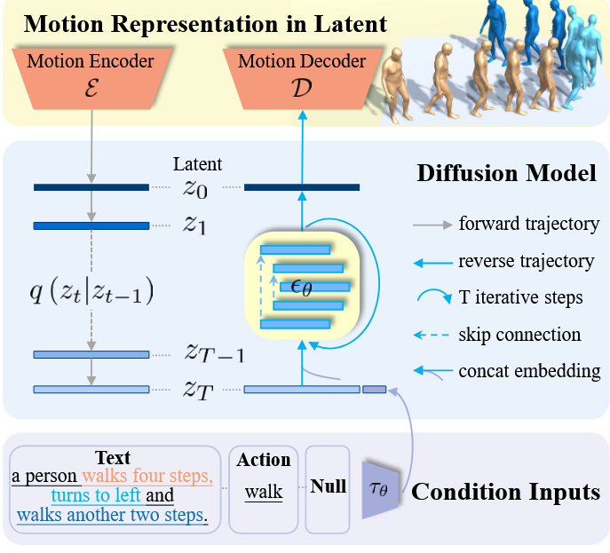

### 1. 模型设 计的核心思想

> MLD结合了两种现有方法的优势

- **基于隐空间的生成**：首先通过**VAE**把人体动作序列映射到低维的隐空间中，进行紧凑表示。这可以减少冗余信息、噪声，同时保留足够的生成信息。

- **基于条件扩散的生成**：在隐空间中使用**diffusion model**来进行生成，而不是直接在原始动作序列上进行，这能够更加高效地处理条件输入（如文本描述）与动作序列的复杂映射。

### 2. 方法结构

 

1. **运动变分自编码器（VAE）**：
   - 该模型使用基于Transformer的架构，分为**编码器**和**解码器**两个部分。
     - **Encoder **：将输入的运动序列编码为低维度的潜在表示 $Z_0$。
     - **Decoder**：用来解码生成的潜在表示  $Z_0$，最终还原成运动序列。
     - VAE的训练包含了重构误差（均方误差MSE）和KL散度损失，以确保潜在空间的低维表示既具有代表性，又具有信息密度高的特性。
2. **运动潜在扩散模型（MLD）**：
   - 在运动潜在空间中进行扩散过程，该过程分为**噪声注入**和**噪声去除**两个阶段。
     - **向前扩散**：逐步向运动序列的潜在表示 $Z_0$中注入噪声，逐步使$Z_T$逼近标准正态分布的纯噪声图像。训练过程就是最小化模型预测的噪声与实际加入的噪声之间的差异。
     - **反向扩撒**：从高斯分布中随机采样一个完整的噪声$Z_T∼N(0,I)$，利用预测的噪声对$X_t$进行去噪得到$X_{t-1}$。通过多步迭代，扩散模型逐渐将噪声表示还原成接近原始运动的潜在表示$\hat{Z_0}$。
   - 此扩散模型采用了**transformer-based denoising model with long skip connections**，适合处理序列数据，如人体运动序列。
3. **条件输入**
   - **条件输入**模块包含两种条件：**文本描述**和**动作标签**（如 walk）这些输入通过嵌入模块 $\tau_\theta$ 进行编码。
   - 在模型生成阶段，通过条件去噪器 $\theta(z_t, t, c)$ 实现，指导扩散模型生成符合条件的运动。
     - 文本到运动的生成 $x_{1:L}Gw:w_{1:N}→x1:L$
     - 动作到运动的生成 $x_{1:L}Ga:a→x1:L$


### 3. 总体流程

1. **输入**：文本或动作标签等条件输入。
2. **编码器（E）**：将运动序列编码为低维潜在表示。
3. **扩散过程**：在潜在空间中进行扩散，逐步去除噪声，生成运动潜在表示。
4. **解码器（D）**：将去噪后的潜在表示解码为运动序列。


------


## 概率映射(probabilistic mapping)

> 概率映射（probabilistic mapping）指的是在不同模态之间（例如文本描述和人体动作序列）建立的概率关系。简单来说，就是给定某个条件（例如一个特定的文本描述或动作类别），模型需要学习从这个条件生成对应的人体动作序列的分布。
>

​	在文章中，作者提到人体动作和条件模态（例如文本描述）之间的分布差异很大。由于人体动作非常多样，而文本描述等条件信息是相对简洁的，因此很难直接从条件信息推断出具体的动作。为了应对这种复杂性，模型需要学习一个概率映射来描述在给定条件下，动作序列可能出现的方式——这就是所谓的“概率映射”。

​	这个映射需要学习从条件输入（比如文本描述）到动作序列的所有可能性，但因为动作序列本身可能包含很多噪声和冗余信息，直接在原始数据上学习这个映射代价很高，并且可能导致生成不准确的结果。因此，文章提出通过VAE先把动作序列转换成低维的“隐空间”，再在这个隐空间里进行扩散模型的学习，这样既能保持数据的有效性，又能减少计算开销。

## Method

### 1. **Motion Latent Representation in Latents (动作的隐空间表示)**

这部分主要介绍如何使用**VAE（变分自编码器）**来学习人体动作的隐空间表示。以下是详细的分解：

#### **核心步骤**：
- **VAE 的结构**：VAE 是一种常用于生成模型的结构，分为编码器（Encoder, E）和解码器（Decoder, D）两部分。编码器将输入的数据（这里是人体动作序列）压缩到一个低维的隐空间中（latent space），解码器则将这个低维表示解压回原始的数据。
- **损失函数**：
  - **MSE（均方误差）**：用于衡量解码后动作序列与原始序列的差异。
  - **KL散度（Kullback-Leibler Divergence）**：用于约束隐空间的分布，使得它接近一个标准正态分布。

#### **细节**：
- **Transformer-based Architecture**：编码器和解码器的主体部分是基于 Transformer 的。这种结构特别擅长处理序列数据，如人体动作的帧序列（frame-wise motion features）。使用 Transformer 的原因是它能够很好地捕捉时间序列中的长距离依赖关系。
- **长跳跃连接（Long Skip Connections）**：为了防止在编码解码过程中丢失重要的细节信息，模型使用长跳跃连接，将编码器的一些中间结果直接传递到解码器中，保留更多的局部信息。
- **Reparameterization Trick**：为了实现从编码器的输出中采样隐空间向量 \( z \)，采用了重参数化技巧。这使得模型能够在训练过程中计算梯度。

#### **总结**：
编码器将动作序列转换为紧凑的低维隐空间表示，解码器则可以从隐空间还原出完整的动作序列。这种设计的优点是：
1. 隐空间的表示更加稠密，包含了最重要的动作信息。
2. 隐空间维度较低，减少了计算负担。

---

### 2. **Motion Latent Diffusion Model (动作隐空间扩散模型)**

这一部分是本文的核心创新，提出了在隐空间中进行扩散过程，而不是在原始动作序列上进行。扩散模型是一种生成模型，最初用于图像生成等任务，现在被引入到动作生成中。

#### **扩散模型的核心概念**：
- **扩散过程（Diffusion Process）**：扩散模型通过一个多步的过程，从一个高斯噪声逐渐还原出符合数据分布的样本。具体来说，它通过逐步去除噪声的方式，生成新的数据样本。
- **扩散在隐空间中进行**：与直接在原始动作序列上进行扩散不同，本文将扩散过程限制在通过VAE编码后的隐空间中进行。这不仅减少了原始数据中的噪声和高频干扰，还降低了计算资源的消耗。

#### 核心步骤：
1. **扩散的公式**：
   
   - 扩散模型通过公式
     $$
     q (z_t | z_{t−1}) = N (\sqrt{\alpha_t}z_{t−1}, (1 − \alpha_t) I)
     $$
      表示在每一步t的扩散过程。这里的 $ z_t$ 是隐空间的表示，$\alpha_t$是一个控制噪声采样的超参数。
2. **去噪器 θ**：
   
   - 使用Transformer-based的去噪器 \( \theta (z_t, t) \)，它通过反向扩散（denoising）逐步还原隐空间中的噪声，直到生成出干净的隐空间向量 $z_0$。
3. **解码过程**：
   
   - 在去噪过程完成后，解码器D将生成的 $z_0$ 转换回动作序列。

#### 总结：
相比直接对原始数据扩散，本文提出的隐空间扩散更有效，并且在减少噪声干扰的同时降低了计算复杂度。

---

### 3. Conditional Motion Latent Diffusion Model (条件动作隐空间扩散模型)

在这一部分，模型被拓展为可以根据条件（如文本或动作标签）生成符合条件的动作序列。

#### 条件生成的步骤：
1. 条件输入：
   - 模型引入了条件编码器（domain encoder），如使用 **CLIP** 来处理文本输入，或者使用可学习的嵌入来处理动作类别。
   - 这些条件被嵌入到与去噪器 \( \theta (z_t, t, c) \) 共享的隐空间中，从而影响扩散过程，使生成结果符合输入条件。

2. **分类器自由扩散指导（Classifier-free Guidance）**：
   - 为了在生成时增强结果质量，模型采用了一种叫做"分类器自由扩散指导"的方法。具体来说，它训练去噪器在有条件和无条件情况下都能生成动作序列，并通过线性组合两者来提升生成的质量。

3. **训练目标**：
   - 训练目标函数是最小化条件去噪的损失，即让 \( \theta (z_t, t, \tau_{\theta}(c)) \) 尽可能准确地预测每一步t的噪声，从而更好地生成符合条件的动作序列。


## 代码-资源配置

这段内容详细介绍了一个程序中用于配置的几个关键部分，包括资源路径配置、网络结构配置、实验配置以及默认配置。这些配置通过 YAML 文件定义，为程序提供灵活的定制方式。以下是详细的解释：

------

### **1. 资源路径配置（Asset Path Configuration）**

- **目的**：定义程序中所需的资源（如数据集、依赖项等）的文件路径。

- 默认行为

  - 程序默认使用文件 `configs/assets.yaml` 作为资源配置文件。

- 如何自定义

  1. **直接修改默认文件**：将 `configs/assets.yaml` 中的路径替换为你自己的资源路径。

  2. 创建新文件

     - 根据 `configs/assets.yaml` 中的注释，创建一个新的 YAML 配置文件。
  - 使用命令行参数 `--cfg_asset` 指定你的自定义 YAML 文件。
  
- **作用**：为程序运行提供正确的数据集路径和依赖项。

------

### **2. 网络结构配置（Network Structure Configuration）**

- **目的**：定义模型的网络结构及其参数。

- 模型组成

  - **Motion VAE**：变分自编码器，用于处理动作的潜在表征。
  - **Text Encoder**：文本编码器，例如 CLIP，用于将文本输入转化为特征向量。
  - **Diffusion Denoiser**：扩散去噪网络，用于去除生成过程中的噪声。
  - **Diffusion Scheduler**：扩散调度器，用于控制扩散过程的步数和噪声强度。
  - **Evaluators**：用于评估模型性能的模块，复用了前人工作中的评估器以确保公平对比。

#### **默认配置**

- 默认情况下，程序会使用 `configs/modules` 文件夹中的 YAML 文件来配置每个部分的网络结构。

#### **如何自定义网络结构**：

1. 直接修改现有配置

   - 修改目标模块的参数或结构（如修改头数、层数等）。

2. 创建新的模块配置

   - 在 `configs/modules` 文件夹的子目录中，创建 5 个新的 YAML 配置文件（对应 5 个模块）。

   - 示例

     - 若创建一个新模块目录 

       ```
        modules_novae
       ```
   
       - 在实验配置中设置 `model.target=modules_novae`。
     - 这样，实验模型会使用 `configs/modules_novae` 中的配置文件。
     
- 参考文件：`config_novae_humanml3d.yaml`。

------

### **3. 实验配置（Experiment Configuration）**

- 目的：定义除了网络结构之外的实验相关设置，包括：

  - 数据集设置。
  - 训练参数（如批量大小、学习率等）。
  - 评估设置（如评估指标）。
  
- 默认文件

  - 相关设置通常存储在 `config_mld_humanml3d.yaml` 文件中。

- 参考方法

  - 可查看文件中的注释以了解详细配置选项。

------

### **4. 默认配置（Default Configuration）**

- **目的**：定义程序的基本默认设置。
- **作用**：为程序提供初始配置，所有特定的自定义设置（资源路径、网络结构、实验设置等）会覆盖这些默认值。
- 默认文件
  - 默认配置存储在 `configs/base.yaml` 文件中。

------

### **总结与使用方法**

#### **配置层级的优先顺序**

1. **实验配置和网络结构配置**的优先级高，会覆盖默认配置。
2. 如果指定了自定义配置文件（如通过 `--cfg_asset`），自定义设置会进一步覆盖默认配置。

#### **如何应用**：

- **简单修改**：直接修改默认的 YAML 文件，例如 `configs/assets.yaml` 或 `configs/modules` 中的相关文件。
- **完整自定义**：创建新的 YAML 配置文件并通过命令行参数指定新配置，例如 `--cfg_asset` 或 `model.target=modules_novae`。

这样设计的配置机制，使得用户可以灵活调整程序的运行参数，而不需要直接修改代码逻辑。


## 网络模型

**Motion VAE**：表示和生成动作潜在空间。

**Text Encoder**：理解语言描述，提供语义指导。

**Diffusion Denoiser**：高质量生成动作数据。

**Diffusion Scheduler**：精确控制生成过程。

**Evaluators**：评估结果，确保生成数据的可靠性和相关性。
