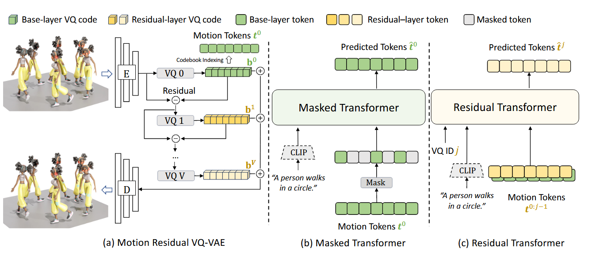
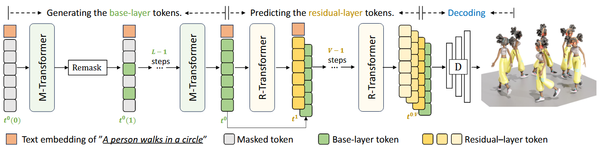

这篇论文的引言主要围绕 **文本到运动生成（text-to-motion generation）** 这一新兴研究任务展开，探讨其背景、现有方法的局限性，以及本文所提出方法的创新点和贡献。以下是引言的核心内容：

1. **研究背景与应用场景：**
   - 文本到运动生成是一项新兴任务，在视频游戏、元宇宙、虚拟现实（VR）和增强现实（AR）等领域有广泛的潜在应用。
   - 最近几年，这一领域吸引了大量研究兴趣，尤其是基于生成式Transformer的研究方向。
2. **现有方法与问题：**
   - 现有方法通常通过向量量化（VQ）将运动数据转化为离散的运动token序列，然后使用自回归模型按单向顺序生成token。这些方法虽然取得了不错的效果，但存在两大缺陷：
     - **量化误差：** VQ引入的近似误差限制了生成质量。
     - **单向解码的局限性：** 单向解码仅利用上下文的前序信息，导致生成模型表达能力受限，并且容易在生成过程中累积错误。
   - 尽管一些研究尝试使用离散扩散模型进行双向解码，但这些方法计算复杂，生成过程需要数百次迭代，效率较低。
3. **本文方法：**
   - 提出了一种名为 **MoMask** 的新框架，通过残差向量量化（RVQ）技术和生成式掩码Transformer（Masked Transformer）实现高效的文本到运动生成。
   - MoMask框架的三个关键组件：
     - **RVQ-VAE（残差向量量化VAE）：** 通过分层的量化设计逐步减少量化误差，生成多层运动token。
     - **M-Transformer（掩码Transformer）：** 基于BERT模型，通过多次迭代生成底层token序列，每次迭代同时预测所有掩码的token，并在信心最高的token上逐步收敛。
     - **R-Transformer（残差Transformer）：** 在生成底层token之后，逐层预测残差token序列，仅需约15次迭代即可生成完整的运动序列。
4. **贡献与实验结果：**
   - 提出首个针对文本到运动生成任务的生成式掩码建模框架。
   - 方法在HumanML3D和KIT-ML数据集上达到了新的SOTA性能，生成质量显著提升，同时生成过程高效。
   - 框架还能推广到相关任务（如文本引导的运动修复）。

总结来说，本文的引言从研究背景和现有问题入手，突出现有方法的不足，然后介绍MoMask框架的创新之处及其在生成质量和效率上的优势。

$ X_t^1 ... X_t^N $

#### **方法总框架**

1. **VQ-VAE**

   - **目标：**将一个运动序列转化为一组**离散的运动tokens**，同时允许多层逐步量化与重建。

   - **编码器**：
     - 将输入运动序列$x$压缩为离散的量化表示 $q_0, q_1, \dots, q_v$ （多层量化）。
     - 第 i 层的量化结果 $vq_i$ 表示当前层的信息，残差 $b_i$ 则包含未捕获的细节。
   - **中间过程**
     - $x$被映射到第 i 层codebook，生成量化结果$vq0$。
     -  计算残差：$b_i=b_{i−1}−vqi$。然后将残差$b_i$ 作为输入，通过后续层的 codebook 再次量化生成 $vq_{i+1}$。

   - **解码器**：
     - 累积所有层的量化表示，可以重构接近原始输入的结果 $x≈\sum_{i=0}^L vqi$

2. **Masked Transformer** ：对 $q_i$ 进行补全

   - **目标：**根据量化的运动序列 token($q_0$) 和文本条件预测遮蔽部分的 token。

   - **目标函数**：训练目标是最小化遮蔽 token 的预测误差

3. **Residual Transformer **：对$b_i$进行更深的预测
   - **目标：**逐层修正 RVQ 的残差表示，最终提高解码器的重建精度。

#### **生成过程（Inference process）**

**阶段划分**：

- 第一阶段：通过 Mask-Transformer 生成基础层 token $t^0$。
  - 文本描述的嵌入 $\mathbf{t}_{\text{embedding}}$（例如："A person walks in a circle"）
  - 初始序列 $t^0$，初始时是空序列。
  - 在每次生成中，对序列 $t^0(i)$ 中还未填充的位置进行重新 mask。**用于捕捉主要的全局信息**
- 第二阶段：通过 R-Transformer 逐层预测残差 token $t^1, t^2, \dots, t^V$。
  - 每一层的残差 token 提供更细化的信息，用来补充基础层 token 中未包含的细节。
  - 残差层 tokens 是逐层生成的，细化了基础层 token 的信息。**用于逐步细化基础层的信息**

**最终解码**：

- 将所有层的 token 拼接，使用VQ-VAE的Encoder还原为目标数据（如 3D 人体运动）。

#### **RVQ-VAE 编码过程**

为了改善常规VQ-VAE的重建质量，文中提出了 **残差量化**（Residual Quantization，RQ）。RQ的核心思想是在量化过程中逐步细化潜在向量的表示，以减小信息丢失。

1. **输入处理**
    将原始动作序列 $m_{1:N}∈R^{N×D}$ 输入到编码器 E。编码器通过一维卷积操作，将高维时间序列压缩为一个低维的潜在表示 ${b}_{1:n} \in \mathbb{R}^{n \times d}$，其中 $n/N$ 是下采样率，$d$ 是潜在表示的维度。
2. **残差量化 (RQ)**
   - 编码器输出：运动潜在序列 $\tilde{b}$
   - 递归计算每一层的量化
     - 初始残差 $r_0 = \tilde{b}$。
     - 对于每一层 v，计算量化结果 $b_v$ 和新的残差 $r_{v+1}$
     - 更新残差：$b_v=Q(r_v)$,  $ r_{v+1} = r_v - b_v$。
3. **量化输出**
   - $\tilde{b}$ 的最终近似值为所有量化结果的和： $\tilde{b} \approx \sum_{v=0}^V b_v$
   - 量化后的离散 token 序列 $T = [t_{1:v}]_{v=0}^V$ 表示为每层量化的代码簇索引 $t_v \in \{1, \dots, |C_v|\}$，用于隐空间建模。

#### **Transformer 模块（隐空间建模与生成）**

1. **离散隐空间表示**
    Transformer 接收来自编码器的离散 token 序列 T=[t1:v]v=0VT = [t_{1:v}]_{v=0}^V。这些 token 表示了动作序列的核心特征（包括基本动作和细节层次信息）。
2. **自注意力机制建模**
   - Transformer 利用自注意力机制，建模 token 序列中的全局时序关系和层次结构。
   - 通过自注意力机制，可以捕捉动作的长程依赖关系和各层量化特征之间的交互。
   - 例如，输入序列中的动作关键帧 token 和细节 token 会被结合起来，生成新的序列。
3. **生成新隐空间序列**
   - Transformer 生成新的隐空间 token 序列 T′=[t1:v′]v=0VT' = [t'_{1:v}]_{v=0}^V，表示预测或生成的离散潜在表示。
   - 在条件生成任务中（如 HumanML3D），文本或其他条件也可以作为 Transformer 的输入，以指导生成符合条件的动作序列。

#### **RVQ-VAE 解码过程**

1. **组合量化结果**

   - 将 Transformer 生成的离散 token 序列 T′T' 转换回离散代码向量 [b1:v′]v=0V[b'_{1:v}]_{v=0}^V：

     bv′=Cv[t1:v′]b'_v = C_v[t'_{1:v}]

     其中 CvC_v 是每层量化器的代码簇。

   - 将所有离散代码向量累加，恢复最终的潜在表示：

     b~′=∑v=0Vbv′\tilde{b}' = \sum_{v=0}^V b'_v

2. **解码器重建动作序列**

   - 解码器 DD 将潜在表示 b~′\tilde{b}' 还原为动作空间中的重建序列 m^\hat{m}： m^=D(b~′)\hat{m} = D(\tilde{b}')
   - 解码器通过反卷积或其他上采样机制，将低维的潜在表示映射回高维的时间序列。

3. **高保真重建**

   - 解码过程经过训练优化，可以最大限度地还原动作细节，确保生成动作的物理一致性和时间连续性。
   - 残差量化的多层结构帮助逐步恢复细节信息，使生成的动作序列更加逼真和细腻。

#### 

