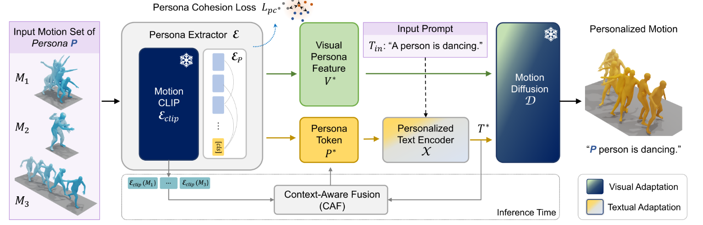
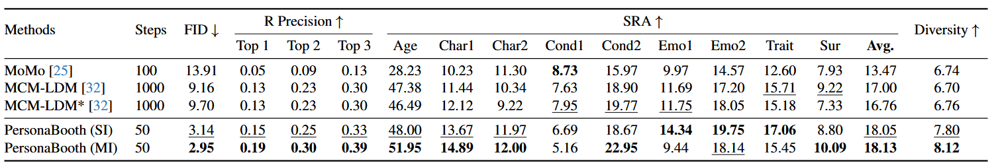
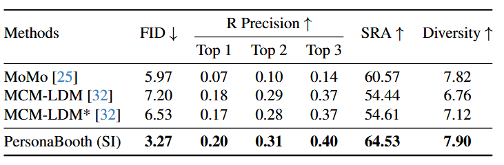

### **背景和意义**

1. **运动个性化的背景**：通过记录用户的少量基础动作（如跳跃、拳击、行走），虚拟人物可以模仿用户的个性化运动风格，使虚拟互动更加逼真。这种技术可应用于游戏和元宇宙场景，并通过文本控制虚拟角色的动作，从而简化视频内容创作。

2. **研究目的**：基于原始动作和文本描述实现**个性化的动作生成**
3. **现有方法的不足**
   - **文本生成动作（Text-to-Motion Generation）**：仅使用文本生成动作，无法体现参考动作的个性化特征。
   - **动作风格迁移（Motion Style Transfer, MST）**：只能从单一动作源迁移风格，难以生成丰富、多样的动作。
   - **数据集和方法的局限性**：现有预训练数据集（如HumanML3D）规模较小，且缺乏体现个性特征的数据。

### **贡献**

1. **Motion Personalization 任务**：基于少量关键动作生成反映个性的多样化动作。
2. 新模型与数据集
   - **PersonaBooth**：预训练文本到动作扩散模型的多模态微调方法，捕捉动作中个性的本质。
   - **PerMo 数据集**：专为Motion Personalization设计设计的新数据集，捕捉了多个演员的个性化动作。
3. 方法创新
   - **多模态微调（multi-modal finetuning）**：将个性化特征融入动作生成过程，提高文本与个性化特征的结合效果。
   - **背景感知（CAF）**：在多个输入动作中，根据提示与输入动作的相似性分配权重，实现更自然的个性特征融合。

### 方法框架

该框架由以下模块组成：

#### **Persona Extractor 模块**

1. 从**运动数据$M_i$**中提取 **视觉个性化特征** $V^*$。
2. 从 $V^*$中进一步生成 **个性化标记** $P^*$，用于捕捉描述个体行为的个性化信息。

#### **Textual and Visual Adaptation 模块**

> 旨在将个性化特征 $P^*$（个性标签）和 $V^*$（视觉特征）整合到现有的预训练框架中

1. **文本适配：**通过个性化文本编码器将$P^*$ 引入到文本特征中，生成个性化文本嵌入$T^*$。
2. **视觉适配：**将$V^*$ 融入到扩散模型的 Transformer 中，通过自适应层动态调节扩散特征取。

#### Context-Aware Fusion (CAF) 模块

1. 在多个输入动作中$M_i$，CAF 动态选择与文本描述$T^*$最**相关的动作特征**。
2. CAF 利用 **MotionCLIP** 中的动作编码器 $E_\text{clip}$ ，对动作$M_i$和文本$T^*$的特征进行对齐。

#### **Motion Diffusion Model 的微调训练过程**

1. 预训练模型：使用的是在HumanML3D上训练了50轮的MDM模型
2. 扩散过程 $\{M_t\}$ 中的噪声时间步 $t$ 通过扩散模型 D 生成动作：$D(M_t,t,V^∗,T^∗)$

### Comment

#### 优点

1. 动作生成的另一个角度：**动作动风格生成**
   - PersonaBooth模型是根据预训练模型微调的：论文中通过微调扩散模型（MDM）的方式，结合了自适应层和其他技术，使得模型能够生成更高质量的个性化动作。
   - 在训练好的模型上进行微调扩展**动作个性化**是一个新奇的研究思路

2. 提出了新的数据集**PerMo**和新的**任务**

   - **Motion Personalization** 任务的核心目标是：生成基于个人化风格或特征的动作，而不仅仅是简单的动作生成。

   - **PerMo** 数据集被设计为评估此任务的一个基准，旨在提供具有多样个体风格动作的样本，以帮助评估和优化基于PersonaBooth模型的生成效果。
   - 采用**SRA**（Style Recognition Accuracy）指标，评估运动风格的准确性

   

#### 缺点

1. 此领域属于比较新的研究方向，现有的benchmark几乎没有。所以它自己提出了一个数据集进行评估

   - 难以与过去的研究进行直接比较，限制了与其他相关方法的广泛对比。

2. 此论文只在**100style**和提出的新数据集**PerMo**上进行了sota方法对比

   - 提出的PerMo数据集专注于Motion Personalization，而100style数据集较少，这可能限制了研究的广泛性
   - 对比的模型较少

   - PreMo上的对比

   - 100style上的对比

   