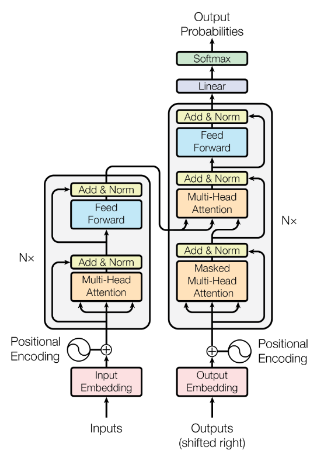
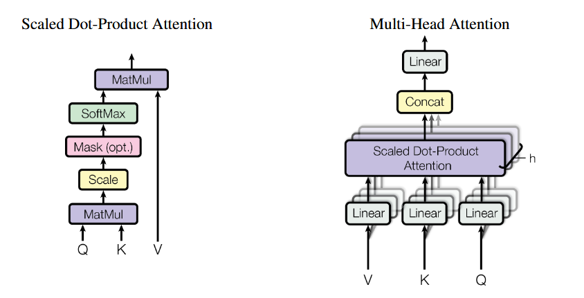
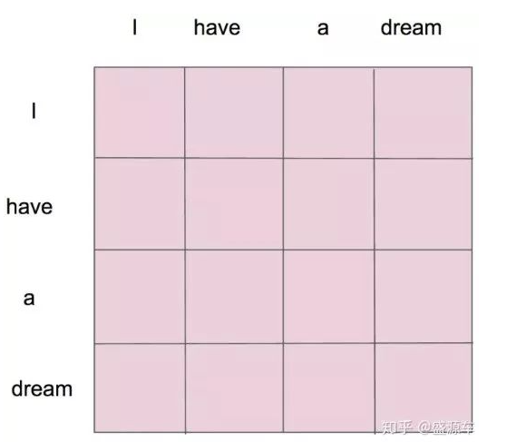
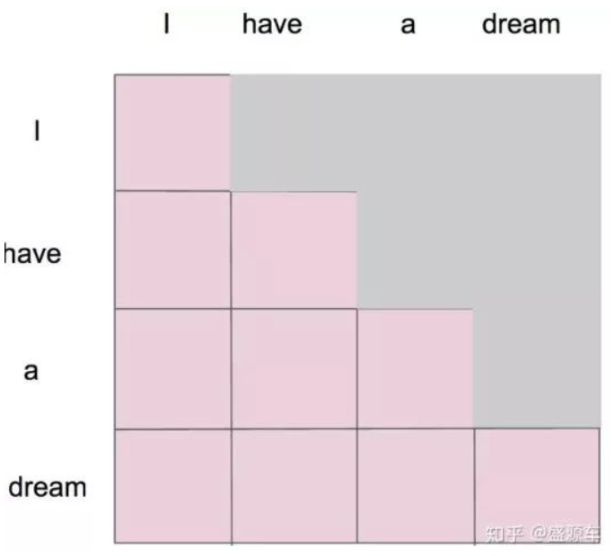

## 摘要

研究目的：传统的**序列建模方法**（如RNN，LSTM）在处理长序列时，难以捕获输入和输出**序列中的长距离依赖关系**，存在效率低、训练时间长的问题。

解决方法：Transformer框架

- self-attention：序列长距离依赖的学习困难

- Multi-Head：计算复杂度与资源占用高

## 方法结构

### **Input Embedding（词嵌入）**

将每个单词转换为一个向量表示，这个向量可以理解为单词在高维空间中的位置，它包含了单词的语义信息。

### **Positional Encoding（位置编码）**

- 作用：Transformer模型中没有RNN或CNN的顺序结构，所以模型没有顺序信息。如果不引入顺序，模型无法理解词语在句子中的先后关系。因此，位置编码用来给每个词的位置加上额外的信息，让模型知道各个**词之间的顺序**。

- 编码方法：使用正弦和余弦函数生成位置编码，并将这些位置编码与词嵌入相加$X=Embedding+Position Embedding$。加到词嵌入上后，使模型既有单词的**语义信息**，也能知道每个词在句子中的**位置信息**。
- 总之就是：**某个单词的位置信息是其他单词位置信息的线性组合，这种线性组合就意味着位置向量中蕴含了相对位置信息。**

### **Feed Forward（前馈神经网络，FFN）**

- FFN网络结构：包括两个线性变换（即矩阵乘法）和一个ReLU激活函数。可以理解为普通的全连接神经网络
- 作用：每个词都会经过这个网络的单独处理，这让每个词的位置可以进一步独立学习高层次特征。以增强模型对复杂特征的理解能力

### **Multi-Head Attention（多头注意力）**

> 注意力：让一个词理解句子中的其他词，从而理解整个句子的上下文。
>
> 多头：注意力并行处理，同时关注不同的词语关系。

多头注意力的工作流程如下：

1. **V,K,Q矩阵**

   - Q：随机一个权重矩阵$W_Q$乘以嵌入向量矩阵$X$得出 查询矩阵$Q$
   - K：随机一个权重矩阵$W_K$乘以嵌入向量矩阵$X$得出 键矩阵$K$
   - V：随机一个权重矩阵$W_V$乘以嵌入向量矩阵$X$得出 值矩阵$V$
   - **注意(QK)到谁，然后调整(V)**

2. **Scaled Dot-product Attention（缩放点积注意力）**

   - MatMul：Q矩阵和K矩阵之间通过**点积**计算出的输入向量对其他输入向量的**“关注程度”或权重分数**。$Q*K^T = sorce$

     **$QK^T$ 其实就会组成一个 word2word 的 attention map！**

     

   - Scale：**缩放因子** $\sqrt{d_k}$，其中k是查询向量的维度。点积可能导致数值过大从而导致softmax的梯度过小，缩放的目的是让点积结果的数值更加稳定。$\frac{Q*K^T}{\sqrt{d_k}}$

   - **Mask**掩码机制：一，为了防止生成下一词时泄露未来的信息(**后文影响前文**)，二，一个训练样本就能提供多次训练机会。

   

   

   

   - **sofrtma**x函数：将每个词的注意力分数进行归一化，映射到概率分布中。$softmax(\frac{Q*K^T}{\sqrt{d_k}})$

   - 通过与 V 矩阵相乘，我们将关注程度（权重）与具体的内容（值）结合起来，从而得到了带权的值的汇总。

     一个词对于其他词的注意得分*V权重再相加，这是加各个词对于它自己在V空间中的投影，本质上是在放大相关词的影响力在自己身上的影响因子
     $$
     Attention(Q,K,V) = softmax(\frac{Q*K^T}{\sqrt{d_k}})V
     $$

   
