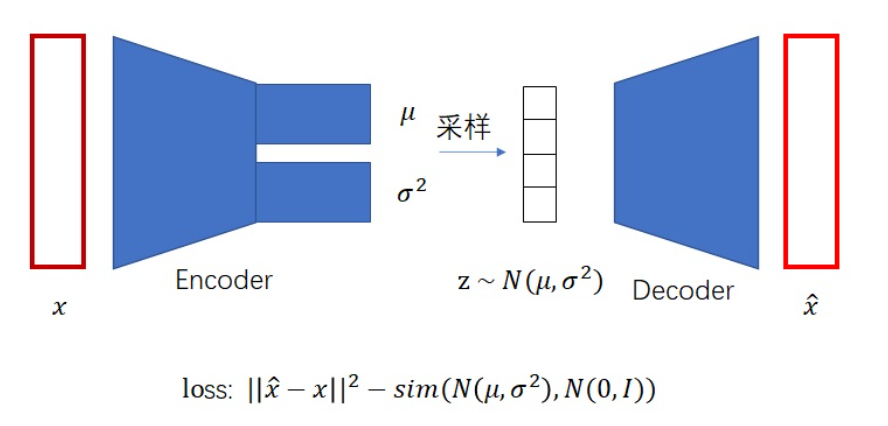
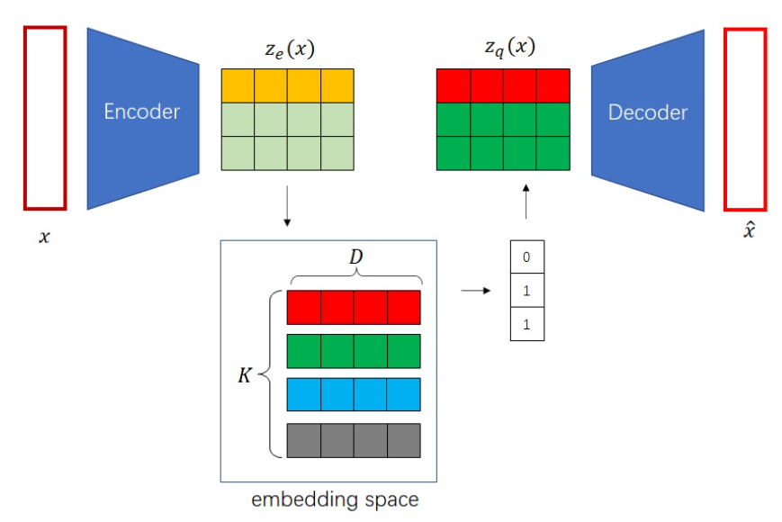

### VAE



1. **编码器**将输入数据映射到潜在空间中，输出一个**参数化的正态分布**$N(μ,σ)$。
2. **采样分布**：$z=μ+σ⊙ϵ,ϵ∼N(0,I)$。通过这种方式，采样操作变成了一个可导的函数，使得可以使用梯度下降算法来优化模型参数。
3. **解码器**从这个分布中采样的潜在变量来重建输入数据。

损失函数

1. 重建损失（Reconstruction Loss）：均方误差
2. KL散度损失（KL Divergence Loss）：使 编码器生成的潜在分布与标准正态分布 $\mathcal{N}(0, I)$ 的相似度最大

### VQ-VAE



1. **编码器**：将输入数据映射到一个连续的潜在向量。

2. **量化**

3. **模块（Vector Quantization）**

   - 定义一个固定的嵌入空间（代码簇）$\{e_1, e_2, \dots, e_K\}$，这些嵌入向量是可以学习的。

   - 对于编码器的每个输出向量 $z_e$，在嵌入空间中找到与其最近的嵌入向量 $e_k$

   $$
   e_k：
   z_q = \underset{e_k \in \{e_1, e_2, \dots, e_K\}}{\mathrm{argmin}} \| z_e - e_k \|_2
   $$

4. **解码器**：使用量化后的离散向量来重建输入数据。

**损失函数**

- 重建损失：均方误差（MSE）
- 量化损失：代码簇向量 $e_k$ 被更新以尽量接近编码器的输出 $z_e$
- 编码器损失：编码器输出$z_e$ 接近其量化值 $z_q$

---

**“替换为码本向量”** 是向量量化（Vector Quantization, VQ）中的核心操作。它的含义是：将编码器输出的**连续特征向量**替换为预定义码本（Codebook）中**最接近的离散向量**。这一过程将连续数据离散化，类似于“用字典中的最近义词替换原词”。以下是详细解释：

---

### **一、直观理解**
假设你有一个码本（类似字典），其中包含 1000 个固定单词（每个单词是一个 512 维向量）。编码器输出的特征向量（如 `[0.2, -1.3, ..., 0.7]`）会与码本中的所有单词逐一对比，找到最接近的那个单词，然后用该单词替换原始向量。

---

### **二、具体步骤**
#### **1. 编码器输出连续特征**
- **输入**：编码器输出的特征向量 `V`，形状为 `(B, d_model, T')`，例如 `(32, 512, 24)`。
- **物理意义**：每个位置（如 24 个时间点）对应一个 512 维的连续向量。

#### **2. 码本（Codebook）**
- **定义**：一个可学习的嵌入矩阵，包含 `K` 个向量，每个维度为 `d_model`。
  ```python
  codebook = nn.Embedding(num_embeddings=K, embedding_dim=512)  # 形状 (K, 512)
  ```
  - **示例**：若 `K=1024`，码本包含 1024 个 512 维向量。

#### **3. 最近邻搜索**
- **计算距离**：对编码器的每个输出向量，计算其与码本中所有向量的欧氏距离。
  $$
  \text{distance}(v_i, e_j) = \|v_i - e_j\|^2 \quad (v_i \in V, e_j \in \text{codebook})
  $$
  
  
  - **代码实现**：
    ```python
    # 输入编码器特征 v_flat: (B*T', 512)
    distances = torch.cdist(v_flat, codebook.weight)  # 形状 (B*T', K)
    ```
  
- **选择最近向量**：找到距离最小的码本索引。
  ```python
  indices = torch.argmin(distances, dim=1)  # 形状 (B*T',)
  ```

#### **4. 替换操作**
- **用码本向量替换原特征**：
  ```python
  quantized = codebook(indices)  # 形状 (B*T', 512)
  ```
  - **示例**：若原向量 `v_i = [0.2, -1.3, ..., 0.7]`，码本中最接近的向量是 `e_42 = [0.3, -1.2, ..., 0.6]`，则 `quantized_i = e_42`。

#### **5. 恢复维度**
- **将量化后的特征恢复为原始形状**：
  ```python
  quantized = quantized.view(B, T', d_model)  # 形状 (32, 24, 512)
  ```

---

### **三、物理意义**
| **步骤**       | **类比**                     | **目的**                   |
| -------------- | ---------------------------- | -------------------------- |
| 编码器输出     | 生成一段连续的声音波形       | 捕捉数据的本质特征         |
| 码本向量       | 预定义的音符库（如钢琴键）   | 提供离散化的基本单元       |
| 替换为码本向量 | 将波形替换为最接近的音符组合 | 用有限符号高效表示复杂数据 |

---

### **四、梯度处理（Straight-Through Estimator）**
- **问题**：`argmin` 操作不可导，无法直接反向传播梯度。
- **解决方案**：在前向传播中使用量化结果，但反向传播时绕过量化步骤，直接将编码器输出的梯度传递给量化后的特征。
  ```python
  quantized = v + (quantized - v).detach()  # 梯度从 quantized 流回 v
  ```

---

### **五、示例说明**
#### **1. 输入数据**
- 编码器输出：`v = [[0.2, 1.1], [-0.5, 0.3]]`（2 个二维向量）。
- 码本：3 个二维向量 `[[0.0, 1.0], [1.0, 0.0], [0.5, 0.5]]`。

#### **2. 计算最近邻**
- 对 `v[0] = [0.2, 1.1]`：
  - 距离码本向量 `[0.0,1.0]` 的距离为 `√[(0.2-0)^2 + (1.1-1)^2] = 0.22`
  - 距离码本向量 `[1.0,0.0]` 的距离为 `1.28`
  - 距离码本向量 `[0.5,0.5]` 的距离为 `0.76`
  - **最近向量**：`[0.0, 1.0]`（索引 0）。

- 对 `v[1] = [-0.5, 0.3]`：
  - 最近向量：`[0.5, 0.5]`（索引 2）。

#### **3. 替换结果**
- 量化后的特征：`quantized = [[0.0, 1.0], [0.5, 0.5]]`。
- 离散索引：`indices = [0, 2]`。

---

### **六、在动作生成中的应用**
- **训练阶段**：
  - 编码器输出 `V` → 替换为码本向量 `O` → 解码器从 `O` 重建动作。
- **生成阶段**：
  - 文本生成模型输出码本索引 → 通过码本查询得到 `O` → 解码器生成动作。

---

### **七、核心优势**
1. **离散化表示**：将连续空间映射到离散符号，更适合语言模型处理（如 GPT）。
2. **压缩数据**：用少量索引替代高维向量，降低存储和传输成本。
3. **可控生成**：通过操作离散索引（如替换、插值）实现动作编辑。

---

通过“替换为码本向量”，RVQ-VAE 将复杂的连续动作数据转化为紧凑的离散符号，为文本到动作生成等任务提供了高效的中间表示。
