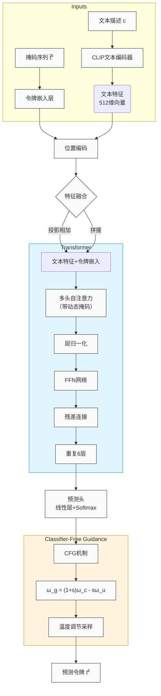

```mermaid
flowchart TD
    %% 输入层
    subgraph Inputs
        A[文本描述 c] --> B[CLIP文本编码器]
        B --> C(文本特征\n512维向量)
        D[掩码序列 t̃⁰] --> E[令牌嵌入层]
    end

    %% 特征融合
    E --> F[位置编码]
    C --> F
    F --> G{特征融合}
    G -->|投影相加| H[文本特征+令牌嵌入]
    G -->|拼接| H

    %% Transformer处理
    subgraph Transformer
        H --> I[多头自注意力\n（带动态掩码）]
        I --> J[层归一化]
        J --> K[FFN网络]
        K --> L[残差连接]
        L --> M[重复6层]
    end

    %% 预测输出
    M --> N[预测头\n线性层+Softmax]
    N --> O[CFG机制]
    subgraph CFG["Classifier-Free Guidance"]
        O --> P["ω_g = (1+s)ω_c - sω_u"]
        P --> Q[温度调节采样]
    end

    %% 输出
    Q --> R[预测令牌 t⁰]

    %% 样式定义
    classDef box fill:#f9f9f9,stroke:#333,stroke-width:1px;
    classDef process fill:#e1f5fe,stroke:#039be5;
    classDef condition fill:#fff3e0,stroke:#fb8c00;
    class A,B,D,E,F,G,I,J,K,L,M,N,O,P,Q,R box
    class CFG condition
    class Transformer process
```